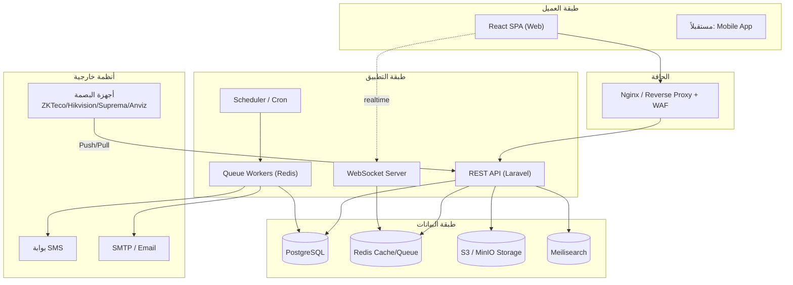

# 00 — الملخص التنفيذي (Executive Summary)

## 1. الرؤية (Vision)

بناء **منصة ويب موحّدة** تدير مكتب المحاماة بالكامل من نقطة دخول واحدة، تربط الموارد البشرية والمالية والقضايا والعملاء والتسويق في نظام واحد متكامل ومترابط البيانات، بحيث يصبح النظام هو **مصدر الحقيقة الوحيد (Single Source of Truth)** للمكتب، ويلغي الاعتماد على ملفات Excel المتفرقة والأنظمة اليدوية.

## 2. الأهداف الاستراتيجية (Business Goals)

| # | الهدف | المؤشر (KPI) |
|---|-------|--------------|
| G1 | مركزية بيانات القضايا والعملاء | 100% من القضايا مُدارة رقمياً |
| G2 | أتمتة الحضور والرواتب | تقليل زمن إعداد مسير الرواتب بنسبة 90% |
| G3 | رفع نسبة تحصيل الأتعاب | متابعة الفواتير المستحقة آلياً + إشعارات |
| G4 | عدم تفويت أي جلسة | إشعار آلي قبل كل جلسة بـ 24 ساعة و 1 ساعة |
| G5 | شفافية مالية | تقارير أرباح/خسائر لحظية |
| G6 | قابلية التوسع | دعم النمو من 10 إلى 500+ موظف دون إعادة بناء |
| G7 | الامتثال والأمان | Audit Trail كامل + تشفير + MFA |

## 3. النطاق (Scope)

### داخل النطاق (In-Scope)
- إدارة الموارد البشرية الكاملة (موظفون، حضور، إجازات، رواتب، تقييم أداء).
- الربط المباشر مع أجهزة البصمة (ZKTeco, Hikvision, Suprema, Anviz).
- إدارة القضايا والجلسات والمستندات القانونية والأرشفة الإلكترونية.
- إدارة العملاء (أفراد/شركات)، العقود، الفواتير، المدفوعات.
- المحاسبة المالية (قيود، سندات، صندوق/بنك، ضرائب، تقارير).
- التسويق و CRM (حملات، عملاء محتملون، تحويل).
- المهام، الإشعارات، التقارير، لوحة التحكم.
- نظام صلاحيات وأمان متقدم.

### خارج النطاق (Out-of-Scope) — مراحل مستقبلية
- تطبيق جوّال أصلي (Native Mobile) للموظفين والعملاء (Phase 2).
- بوابة عملاء خارجية (Client Portal) لمتابعة القضايا (Phase 2).
- تكامل مع أنظمة المحاكم الحكومية الإلكترونية (Phase 3، حسب توفر الـ API).
- الذكاء الاصطناعي لتلخيص المستندات وصياغة المذكرات (Phase 3).

## 4. أصحاب المصلحة (Stakeholders) والمستخدمون (Personas)

| Persona | الدور | أهم الاحتياجات |
|---------|-------|----------------|
| **المدير العام / الشريك** | Owner | لوحة تحكم شاملة، تقارير مالية، مؤشرات الأداء |
| **مدير الموارد البشرية** | HR Manager | الموظفون، الحضور، الإجازات، الرواتب، التقييم |
| **المحامي** | Lawyer | قضاياه، جلساته، مهامه، مستنداته |
| **المحاسب المالي** | Accountant | الفواتير، السندات، القيود، التقارير المالية |
| **مسؤول التسويق** | Marketing | الحملات، العملاء المحتملون، التحويلات |
| **السكرتارية / الاستقبال** | Secretary | إدخال العملاء، جدولة الجلسات، المهام، الأرشفة |
| **مدير النظام** | Admin | المستخدمون، الأدوار، الإعدادات، النسخ الاحتياطي |
| **الموظف** | Employee | حضوره، طلبات الإجازات، كشف راتبه، مهامه |

## 5. الوحدات الوظيفية (Functional Modules)

1. **HR** — الموظفون، الحضور والانصراف، الإجازات، الرواتب، تقييم الأداء.
2. **الإدارة (Administration)** — الأقسام، الفروع، الأدوار، الصلاحيات، الإعدادات، النسخ الاحتياطي، القوالب.
3. **القضايا (Cases)** — القضايا، الجلسات، المستندات، الأحكام، المذكرات، الخصوم.
4. **العملاء (Clients)** — الأفراد، الشركات، العقود، الفواتير، سجل التواصل.
5. **المالية (Finance)** — الإيرادات، المصروفات، السندات، القيود، الصندوق/البنك، الضرائب، التقارير.
6. **التسويق (Marketing/CRM)** — الحملات، العملاء المحتملون، المتابعة، التحويل.
7. **المهام (Tasks)** — الإنشاء، التوزيع، الأولويات، نسب الإنجاز.
8. **الإشعارات (Notifications)** — In-App، Email، SMS، Push، WebSocket.
9. **التقارير (Reports)** — جميع التقارير مع تصدير PDF/Excel/طباعة.
10. **الأرشفة الإلكترونية (E-Archive)** — تخزين ووسم وبحث المستندات.

## 6. المعمارية عالية المستوى (High-Level Architecture)

## 7. معايير النجاح (Success Criteria)

- ✅ زمن استجابة الصفحات < 500ms لـ 95% من الطلبات (P95).
- ✅ توافر النظام (Uptime) ≥ 99.5%.
- ✅ مزامنة بيانات البصمة خلال ≤ 60 ثانية من التسجيل على الجهاز.
- ✅ إعداد مسير رواتب 10 موظفين خلال < 5 دقائق.
- ✅ صفر فقدان للبيانات (RPO ≤ 15 دقيقة، RTO ≤ 1 ساعة).
- ✅ تغطية Audit Trail لـ 100% من العمليات الحساسة.

## 8. الافتراضات والقيود (Assumptions & Constraints)

**افتراضات:**
- توافر اتصال إنترنت مستقر في المكتب لمزامنة البصمة السحابية، أو تشغيل خادم محلي (On-Prem) عند الحاجة.
- أجهزة البصمة تدعم SDK/API (معظم موديلات ZKTeco/Hikvision الحديثة تدعمها).

**قيود:**
- واجهة النظام تدعم **العربية (RTL) والإنجليزية (LTR)** كحد أدنى.
- الالتزام بأنظمة حماية البيانات المحلية وسرية معلومات العملاء (Attorney-Client Privilege).

## 9. المخاطر وخطة التخفيف (Risks & Mitigation)

| المخاطرة | الاحتمال | الأثر | التخفيف |
|----------|----------|-------|---------|
| اختلاف بروتوكولات أجهزة البصمة | متوسط | عالٍ | طبقة تجريد Adapter لكل مورّد + جدول Staging |
| تسرّب بيانات العملاء السرية | منخفض | حرج | تشفير عند الراحة والنقل، RBAC، Audit، MFA |
| فقدان بيانات مالية | منخفض | حرج | نسخ احتياطي آلي + قيود محاسبية غير قابلة للحذف |
| تأخر مزامنة الحضور | متوسط | متوسط | آلية Retry + Fallback تسجيل يدوي |
| نمو البيانات (مستندات) | عالٍ | متوسط | تخزين S3 + أرشفة تدريجية + فهرسة بحث |
| مقاومة المستخدمين للتغيير | متوسط | متوسط | تدريب + واجهة عربية بسيطة + هجرة تدريجية |

## 10. التسليمات (Deliverables)

1. مستند التحليل والتصميم (هذا المستند).
2. مخطط قاعدة البيانات (ER) + سكربتات الترحيل (Migrations).
3. تصميم واجهات (Wireframes / UI Kit).
4. نظام يعمل عبر بيئات: تطوير → اختبار → إنتاج.
5. دليل مستخدم + دليل مدير النظام.
6. خطة نسخ احتياطي واستعادة.
