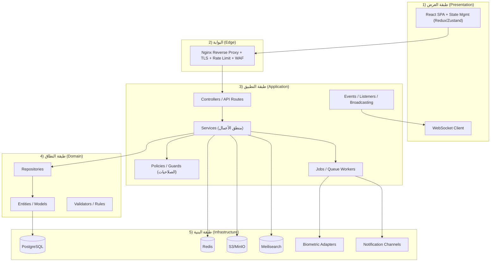
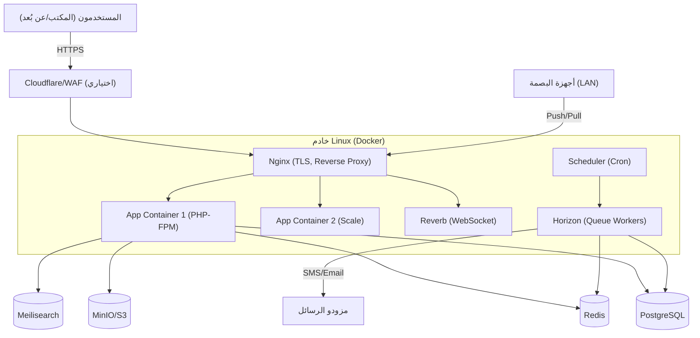

# 01 — المعمارية والتقنيات (Architecture & Technology Stack)

## 1. مبادئ التصميم (Design Principles)

| المبدأ | الوصف |
|--------|-------|
| **Separation of Concerns** | فصل الواجهة (Frontend) عن الخدمات (Backend API) عن البيانات. |
| **API-First** | كل عملية تمر عبر REST API موثّق (OpenAPI)، تمهيداً لتطبيق الجوال والبوابات. |
| **Modular Monolith** | نبدأ بـ Monolith منظّم في وحدات (Modules) مستقلة منطقياً، قابل للتقسيم لاحقاً إلى Microservices عند الحاجة. |
| **Scalability by Design** | تصميم قابل للتوسع الأفقي (Stateless API + Redis + Load Balancer). |
| **Security by Default** | تشفير، صلاحيات دقيقة، Audit، مبدأ أقل امتياز (Least Privilege). |
| **Multi-Tenant Ready** | جميع الجداول الأساسية تحمل `branch_id` / `tenant_id` لدعم الفروع وتعدد المكاتب. |
| **Soft Delete + Audit** | لا حذف نهائي للبيانات الحساسة، بل حذف منطقي مع سجل. |
| **i18n / RTL** | دعم العربية (RTL) والإنجليزية أصلياً في الطبقتين. |

## 2. لماذا Modular Monolith وليس Microservices؟

لمكتب من 10 موظفين، الـ Microservices تُدخل تعقيداً تشغيلياً (شبكة، توزيع معاملات، مراقبة) غير مبرر. الـ **Modular Monolith** يوفّر:
- بساطة النشر والتطوير والمعاملات (Transactions) المحلية.
- حدود وحدات (Module Boundaries) واضحة في الكود.
- مسار ترقية واضح: عند نمو المكتب، تُفصل الوحدة الأثقل (مثل الأرشفة/التقارير) إلى خدمة مستقلة.

## 3. المعمارية الطبقية (Layered Architecture)

**تدفق الطلب (Request Flow):**
`المستخدم → Nginx (TLS/WAF) → Controller → Middleware (Auth/RBAC) → Service (Business Logic) → Repository → DB` ثم الاستجابة، مع إطلاق Events للإشعارات والبث اللحظي عبر WebSocket.

## 4. الـ Stack التقني المقترح والمبرَّر

### 4.1 الواجهة الأمامية (Frontend)

| العنصر | الاختيار | المبرر |
|--------|----------|--------|
| Framework | **React 18 + TypeScript** | نظام بيئي ضخم، توظيف سهل، مثالي للوحات التحكم الغنية بالبيانات |
| Build | **Vite** | سرعة تطوير وبناء عالية |
| State | **Redux Toolkit / Zustand + React Query** | إدارة حالة + Caching للطلبات |
| UI Kit | **Ant Design** (غني بجداول/نماذج مؤسسية) + **TailwindCSS** | سرعة بناء + دعم RTL |
| Charts | **ECharts / Recharts** | رسوم بيانية للوحة التحكم |
| Forms | **React Hook Form + Zod** | نماذج قوية مع تحقق |
| i18n | **react-i18next** | العربية/الإنجليزية + RTL |
| PDF Viewer | **pdf.js** | معاينة المستندات المؤرشفة |

> **البديل Flutter Web:** ممتاز إن أُريد كود موحّد مع تطبيق جوّال لاحقاً، لكن React أنسب للوحات تحكم الويب الثقيلة بالبيانات وأسهل توظيفاً. **التوصية: React** للويب، مع فتح الباب لـ Flutter لتطبيق الجوال في Phase 2.

### 4.2 الخلفية (Backend)

| العنصر | الاختيار | المبرر |
|--------|----------|--------|
| Framework | **Laravel 11 (PHP 8.3)** | إنتاجية عالية، Eloquent ORM، Queue/Scheduler/Broadcasting جاهزة، مجتمع عربي واسع |
| Auth | **Laravel Sanctum/Passport (JWT) + Refresh** | مصادقة SPA/API |
| Permissions | **spatie/laravel-permission** (RBAC) + Policies (ABAC) | صلاحيات مرنة |
| Queue | **Laravel Queue + Redis + Horizon** | مهام خلفية (إشعارات، PDF، مزامنة بصمة) |
| Realtime | **Laravel Reverb (WebSocket)** | بث لحظي بدون خدمة خارجية |
| Excel/PDF | **Maatwebsite/Excel** + **Browsershot (Puppeteer)** | تصدير التقارير |
| Search | **Laravel Scout + Meilisearch** | بحث سريع في القضايا/المستندات |
| Audit | **owen-it/laravel-auditing** | Audit Trail آلي |

> **البدائل:** **ASP.NET Core 8** (أداء عالٍ، مثالي لبيئات مايكروسوفت) أو **NestJS (Node.js)** (كود موحّد مع Frontend بـ TypeScript). **التوصية: Laravel** للسرعة الإنتاجية وملاءمته للسوق، مع بقاء المعمارية محايدة (API-First) بحيث يمكن استبدال الـ Backend دون المساس بالواجهة.

### 4.3 قاعدة البيانات والتخزين

| العنصر | الاختيار | المبرر |
|--------|----------|--------|
| RDBMS | **PostgreSQL 16** | معاملات قوية، JSONB، فهارس متقدمة (GIN/GiST)، دقة مالية (NUMERIC)، Full-Text عربي |
| Cache/Queue/Session | **Redis 7** | تخزين مؤقت، طوابير، جلسات، Rate Limit، Pub/Sub |
| Object Storage | **MinIO (S3-compatible)** / AWS S3 | مستندات القضايا، صور، مرفقات، نسخ احتياطية |
| Search Engine | **Meilisearch** | بحث فوري بالعربية في المستندات والقضايا |
| Backup | **pgBackRest / wal-g** | نسخ احتياطي تزايدي + PITR |

> **لماذا PostgreSQL وليس MySQL؟** دعم أقوى للبيانات المالية (NUMERIC الدقيق)، JSONB للحقول المرنة، Full-Text Search، وصلاحيات صفوف (RLS) لو احتجناها. MySQL خيار صالح لكن PostgreSQL أنسب لنظام مالي/قانوني.

### 4.4 البنية التحتية والنشر (DevOps)

| العنصر | الاختيار |
|--------|----------|
| Containerization | **Docker + Docker Compose** (Kubernetes لاحقاً عند التوسع) |
| Web Server | **Nginx** (Reverse Proxy + TLS Termination + Static + Rate Limit) |
| OS | **Ubuntu Server LTS 22.04/24.04** |
| CI/CD | **GitHub Actions / GitLab CI** (Build → Test → Deploy) |
| TLS | **Let's Encrypt (Certbot)** أو شهادة مؤسسية |
| Monitoring | **Prometheus + Grafana** + **Sentry** (تتبع الأخطاء) |
| Logs | **Loki / ELK Stack** |
| Secrets | **.env + Vault** (لا أسرار في الكود) |

### 4.5 مخطط النشر (Deployment Topology)

## 5. البيئات (Environments)

| البيئة | الغرض | البيانات |
|--------|-------|----------|
| **Development** | تطوير محلي | بيانات وهمية (Seeders) |
| **Staging/Test** | اختبار QA + UAT | نسخة مُقنّعة (Masked) من الإنتاج |
| **Production** | التشغيل الفعلي | البيانات الحقيقية |

## 6. استراتيجية القابلية للتوسع (Scalability)

- **أفقياً (Horizontal):** API عديم الحالة (Stateless) → إضافة حاويات خلف Load Balancer. الجلسات والكاش في Redis.
- **عمودياً (Vertical):** زيادة موارد قاعدة البيانات.
- **قاعدة البيانات:** فهارس مدروسة، Read Replicas للقراءة الثقيلة (التقارير)، تقسيم (Partitioning) لجداول السجلات الكبيرة (attendance_logs, audit_logs, notifications) حسب التاريخ.
- **الملفات:** S3 قابل للتوسع لا نهائياً.
- **الطوابير:** توسيع عدد Workers لمعالجة الإشعارات/التقارير/مزامنة البصمة.

## 7. النسخ الاحتياطي والاستعادة (Backup & DR)

| العنصر | الاستراتيجية | RPO | RTO |
|--------|--------------|-----|-----|
| PostgreSQL | نسخ يومي كامل + WAL مستمر (PITR) | ≤ 15 دقيقة | ≤ 1 ساعة |
| S3/MinIO | Versioning + مزامنة إلى موقع ثانٍ | فوري | فوري |
| Redis | AOF/RDB (اختياري، بيانات قابلة لإعادة البناء) | — | — |
| الاختبار | استعادة دورية شهرية للتحقق | — | — |

## 8. المعايير غير الوظيفية (NFRs)

| المعيار | الهدف |
|---------|-------|
| الأداء | P95 < 500ms، P99 < 1s |
| التوافر | ≥ 99.5% |
| الأمان | OWASP Top 10، تشفير TLS 1.2+، AES-256 عند الراحة |
| قابلية الصيانة | تغطية اختبارات ≥ 70% للمنطق الحرج |
| قابلية الاستخدام | واجهة عربية RTL، متجاوبة (Responsive)، وصولية (a11y) |
| الامتثال | Audit Trail، الاحتفاظ بالبيانات، سرية العميل-المحامي |
