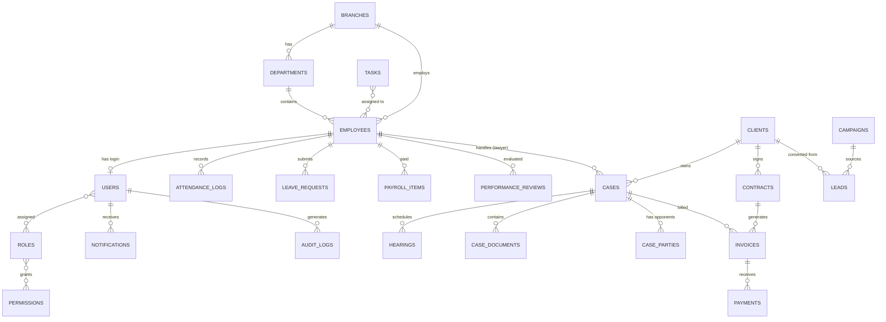
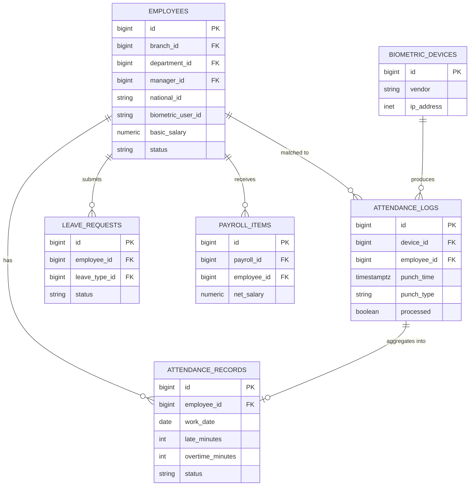

# 02 — تصميم قاعدة البيانات (Database Design)

قاعدة بيانات **PostgreSQL 16** علائقية مُطبّعة (3NF) مع حقول JSONB للمرونة عند الحاجة. جميع الجداول تتبع الاصطلاحات التالية:

## اصطلاحات عامة (Conventions)

- **المفتاح الأساسي (PK):** `id BIGINT GENERATED ALWAYS AS IDENTITY` (أو UUID للكيانات المعرّضة خارجياً).
- **الحقول الزمنية القياسية على كل جدول:** `created_at`, `updated_at` (TIMESTAMPTZ)، و`deleted_at` (Soft Delete) للجداول الحساسة.
- **التتبّع:** `created_by`, `updated_by` (FK → users.id) على الجداول التشغيلية.
- **العزل متعدد الفروع:** `branch_id` (FK → branches.id) على الجداول التشغيلية.
- **العملة والمبالغ:** `NUMERIC(15,2)` (لا تُستخدم FLOAT للمال إطلاقاً).
- **الحالات (Enums):** جداول مرجعية (Lookup) أو أنواع `ENUM`/`CHECK` — نعتمد جداول مرجعية للمرونة.
- **الفهارس:** على كل FK، وعلى الحقول كثيرة البحث/الفرز (status, dates, national_id...).

---

## 1. مخطط العلاقات المفاهيمي (Conceptual ER — نظرة عليا)

---

## 2. مجموعات الجداول (Schema Groups)

النظام مقسّم منطقياً إلى مخططات (Schemas) أو بادئات (Prefixes):

| المجموعة | البادئة | الجداول الرئيسية |
|----------|---------|-------------------|
| النواة والأمان | `core_` / `auth_` | users, roles, permissions, branches, settings, audit_logs |
| الموارد البشرية | `hr_` | employees, departments, attendance, leaves, payroll, reviews |
| القضايا | `case_` | cases, hearings, documents, parties, judgments, memos |
| العملاء والعقود | `crm_` | clients, contracts, communications |
| المالية | `fin_` | invoices, payments, vouchers, accounts, journal_entries, taxes |
| التسويق | `mkt_` | campaigns, leads, lead_activities |
| المهام والإشعارات | `ops_` | tasks, notifications, notification_settings |
| الأرشفة | `arc_` | documents, document_tags, document_versions |

---

## 3. جداول النواة والأمان (Core & Auth)

### `branches` — الفروع
| العمود | النوع | ملاحظات |
|--------|------|---------|
| id | BIGINT PK | |
| name | VARCHAR(150) | اسم الفرع |
| code | VARCHAR(30) UNIQUE | رمز الفرع |
| address | TEXT | |
| phone | VARCHAR(30) | |
| city | VARCHAR(80) | |
| is_active | BOOLEAN | افتراضي true |
| created_at / updated_at | TIMESTAMPTZ | |

**الوصف:** جذر العزل التنظيمي. كل الكيانات التشغيلية ترتبط بفرع لدعم التوسع لعدة فروع/مكاتب.

### `departments` — الأقسام
| العمود | النوع | ملاحظات |
|--------|------|---------|
| id | BIGINT PK | |
| branch_id | BIGINT FK → branches | |
| name | VARCHAR(120) | مثال: القضايا، المالية، التسويق |
| manager_id | BIGINT FK → employees (Nullable) | مدير القسم |
| parent_id | BIGINT FK → departments (Nullable) | للتسلسل الهرمي |
| is_active | BOOLEAN | |

**الوصف:** الهيكل التنظيمي. `parent_id` يدعم أقساماً فرعية.

### `users` — المستخدمون (حسابات الدخول)
| العمود | النوع | ملاحظات |
|--------|------|---------|
| id | BIGINT PK | |
| employee_id | BIGINT FK → employees (Nullable, UNIQUE) | ربط الحساب بالموظف |
| username | VARCHAR(60) UNIQUE | |
| email | VARCHAR(150) UNIQUE | |
| password_hash | VARCHAR(255) | bcrypt/argon2 |
| mfa_secret | VARCHAR(255) Nullable | سر TOTP (مشفّر) |
| mfa_enabled | BOOLEAN | |
| status | VARCHAR(20) | active/suspended/locked |
| last_login_at | TIMESTAMPTZ | |
| failed_attempts | SMALLINT | لقفل الحساب |
| locked_until | TIMESTAMPTZ Nullable | |
| password_changed_at | TIMESTAMPTZ | لسياسة انتهاء كلمة المرور |
| created_at / updated_at / deleted_at | TIMESTAMPTZ | |

**الوصف:** فصل حساب الدخول عن ملف الموظف يسمح بمستخدمين ليسوا موظفين (مثل مدير نظام خارجي) والعكس.

### `roles` — الأدوار
| العمود | النوع | ملاحظات |
|--------|------|---------|
| id | BIGINT PK | |
| name | VARCHAR(60) UNIQUE | admin, hr, lawyer, accountant... |
| display_name | VARCHAR(120) | الاسم المعروض (عربي) |
| is_system | BOOLEAN | أدوار نظامية غير قابلة للحذف |

### `permissions` — الصلاحيات
| العمود | النوع | ملاحظات |
|--------|------|---------|
| id | BIGINT PK | |
| name | VARCHAR(100) UNIQUE | مثال: `cases.create`, `payroll.approve` |
| module | VARCHAR(40) | الوحدة التابعة |
| description | VARCHAR(200) | |

### `role_permission` — ربط (M:N)
| العمود | النوع |
|--------|------|
| role_id | BIGINT FK → roles |
| permission_id | BIGINT FK → permissions |
| **PK مركّب** | (role_id, permission_id) |

### `user_role` — ربط (M:N)
| العمود | النوع |
|--------|------|
| user_id | BIGINT FK → users |
| role_id | BIGINT FK → roles |
| branch_id | BIGINT FK → branches (Nullable) | دور مقيّد بفرع |
| **PK مركّب** | (user_id, role_id, branch_id) |

### `user_permission` — استثناءات مباشرة (اختياري)
منح/سحب صلاحية لمستخدم بعينه فوق دوره (`grant`/`revoke`) — لمرونة ABAC.

### `sessions` — الجلسات النشطة
| العمود | النوع | ملاحظات |
|--------|------|---------|
| id | VARCHAR(100) PK | معرّف الجلسة/التوكن |
| user_id | BIGINT FK → users | |
| ip_address | INET | |
| user_agent | TEXT | |
| device | VARCHAR(120) | |
| last_activity | TIMESTAMPTZ | |
| expires_at | TIMESTAMPTZ | |

**الوصف:** إدارة الجلسات (عرض/إنهاء الجلسات النشطة، تسجيل خروج من كل الأجهزة).

### `settings` — إعدادات النظام (Key/Value)
| العمود | النوع | ملاحظات |
|--------|------|---------|
| id | BIGINT PK | |
| branch_id | BIGINT FK (Nullable) | إعداد عام أو خاص بفرع |
| group | VARCHAR(40) | general/email/sms/notifications/payroll |
| key | VARCHAR(80) | |
| value | JSONB | القيمة (نص/رقم/كائن) |
| **UNIQUE** | (branch_id, group, key) | |

### `audit_logs` — سجل التدقيق
| العمود | النوع | ملاحظات |
|--------|------|---------|
| id | BIGINT PK | |
| user_id | BIGINT FK (Nullable) | من نفّذ العملية |
| action | VARCHAR(40) | create/update/delete/login/export/approve |
| auditable_type | VARCHAR(80) | اسم الكيان (مثل Case) |
| auditable_id | BIGINT | معرّف السجل المتأثر |
| old_values | JSONB | القيم قبل |
| new_values | JSONB | القيم بعد |
| ip_address | INET | |
| user_agent | TEXT | |
| created_at | TIMESTAMPTZ | |

**الفهارس:** `(auditable_type, auditable_id)`, `(user_id)`, `(created_at)`. يُقسّم (Partition) شهرياً.

### `activity_logs` — سجل النشاطات (لعرض "آخر النشاطات")
مبسّط للعرض في لوحة التحكم: `user_id, description, subject_type, subject_id, created_at`.

---

## 4. جداول الموارد البشرية (HR)

### `employees` — الموظفون
| العمود | النوع | ملاحظات |
|--------|------|---------|
| id | BIGINT PK | |
| branch_id | BIGINT FK → branches | |
| department_id | BIGINT FK → departments | |
| employee_no | VARCHAR(30) UNIQUE | الرقم الوظيفي |
| full_name_ar | VARCHAR(150) | الاسم بالعربية |
| full_name_en | VARCHAR(150) | الاسم بالإنجليزية |
| national_id | VARCHAR(20) UNIQUE | الرقم الوطني/الهوية |
| birth_date | DATE | تاريخ الميلاد |
| gender | VARCHAR(10) | male/female |
| phone | VARCHAR(30) | |
| email | VARCHAR(150) | |
| address | TEXT | العنوان |
| photo_path | VARCHAR(255) | مسار الصورة في S3 |
| job_title | VARCHAR(120) | المسمى الوظيفي |
| manager_id | BIGINT FK → employees (Nullable) | المدير المباشر |
| hire_date | DATE | تاريخ التعيين |
| contract_type | VARCHAR(30) | permanent/temporary/part_time |
| contract_start | DATE | |
| contract_end | DATE Nullable | لتنبيه انتهاء العقد |
| basic_salary | NUMERIC(15,2) | الراتب الأساسي |
| bank_name | VARCHAR(120) | |
| bank_account | VARCHAR(50) | رقم الحساب/IBAN |
| biometric_user_id | VARCHAR(40) Nullable | معرّف الموظف داخل جهاز البصمة |
| status | VARCHAR(20) | active/on_leave/suspended/terminated |
| notes | TEXT | |
| created_at / updated_at / deleted_at | TIMESTAMPTZ | |

**الوصف:** الكيان المحوري في HR. `biometric_user_id` يربط الموظف بسجله في جهاز البصمة. `manager_id` علاقة ذاتية للتسلسل الإداري.

### `employee_allowances` — البدلات (لكل موظف)
| العمود | النوع | ملاحظات |
|--------|------|---------|
| id | BIGINT PK | |
| employee_id | BIGINT FK → employees | |
| type | VARCHAR(40) | housing/transport/phone... |
| amount | NUMERIC(15,2) | |
| is_recurring | BOOLEAN | يتكرر كل شهر |

### `employee_deductions` — الخصومات الثابتة
مماثل للبدلات: `type` (insurance/loan/tax), `amount`, `is_recurring`.

### `employee_documents` — مرفقات الموظف
| العمود | النوع | ملاحظات |
|--------|------|---------|
| id | BIGINT PK | |
| employee_id | BIGINT FK | |
| doc_type | VARCHAR(40) | contract/id_copy/certificate |
| file_path | VARCHAR(255) | S3 |
| expiry_date | DATE Nullable | لتنبيه انتهاء الوثيقة |

### `biometric_devices` — أجهزة البصمة
| العمود | النوع | ملاحظات |
|--------|------|---------|
| id | BIGINT PK | |
| branch_id | BIGINT FK | |
| vendor | VARCHAR(30) | zkteco/hikvision/suprema/anviz |
| model | VARCHAR(60) | |
| ip_address | INET | |
| port | INT | |
| serial_no | VARCHAR(60) UNIQUE | |
| api_mode | VARCHAR(20) | push/pull/sdk/webhook |
| auth_token | VARCHAR(255) Nullable | مشفّر |
| last_sync_at | TIMESTAMPTZ | آخر مزامنة |
| status | VARCHAR(20) | online/offline/error |

**الوصف:** تعريف كل جهاز بصمة وطريقة تكامله (تفاصيل التكامل في [ملف 04](04-attendance-biometrics.md)).

### `attendance_logs` — سجلات البصمة الخام (Staging)
| العمود | النوع | ملاحظات |
|--------|------|---------|
| id | BIGINT PK | |
| device_id | BIGINT FK → biometric_devices | |
| biometric_user_id | VARCHAR(40) | كما ورد من الجهاز |
| employee_id | BIGINT FK (Nullable) | يُطابَق لاحقاً |
| punch_time | TIMESTAMPTZ | وقت البصمة |
| punch_type | VARCHAR(10) | in/out/unknown |
| verify_mode | VARCHAR(20) | fingerprint/face/card/password |
| raw_payload | JSONB | الحمولة الأصلية كما وردت |
| processed | BOOLEAN | هل عولجت إلى attendance_records |
| created_at | TIMESTAMPTZ | |

**الفهارس:** `(device_id, punch_time)`, `(biometric_user_id)`, `(processed)`. يُقسّم شهرياً.
**الوصف:** طبقة استقبال خام (Raw/Staging) لكل نبضة بصمة قبل معالجتها — تضمن عدم فقدان أي سجل حتى لو لم يُطابَق الموظف فوراً.

### `attendance_records` — سجل الحضور اليومي المعالَج
| العمود | النوع | ملاحظات |
|--------|------|---------|
| id | BIGINT PK | |
| employee_id | BIGINT FK → employees | |
| branch_id | BIGINT FK | |
| work_date | DATE | اليوم |
| check_in | TIMESTAMPTZ Nullable | أول دخول |
| check_out | TIMESTAMPTZ Nullable | آخر خروج |
| worked_minutes | INT | دقائق العمل الفعلية |
| late_minutes | INT | دقائق التأخير |
| early_leave_minutes | INT | مغادرة مبكرة |
| overtime_minutes | INT | عمل إضافي |
| status | VARCHAR(20) | present/absent/late/leave/holiday/weekend |
| source | VARCHAR(20) | biometric/manual |
| shift_id | BIGINT FK → work_shifts (Nullable) | |
| approved_by | BIGINT FK → users (Nullable) | لاعتماد التعديل اليدوي |
| notes | TEXT | |
| **UNIQUE** | (employee_id, work_date) | سجل واحد لكل يوم |

**الوصف:** الملخص اليومي المُحتسب من `attendance_logs` مقابل نوبة العمل (`work_shifts`). عليه تُبنى تقارير الحضور والرواتب.

### `work_shifts` — نوبات العمل / الدوام
| العمود | النوع | ملاحظات |
|--------|------|---------|
| id | BIGINT PK | |
| branch_id | BIGINT FK | |
| name | VARCHAR(60) | الدوام الصباحي... |
| start_time | TIME | |
| end_time | TIME | |
| grace_minutes | INT | سماح التأخير |
| weekdays | JSONB | أيام العمل [1..7] |

### `employee_shifts` — ربط الموظف بالنوبة (تاريخي)
`employee_id, shift_id, from_date, to_date`.

### `leave_types` — أنواع الإجازات
| العمود | النوع | ملاحظات |
|--------|------|---------|
| id | BIGINT PK | |
| name | VARCHAR(60) | سنوية/مرضية/طارئة/بدون راتب |
| default_days | INT | الرصيد السنوي الافتراضي |
| is_paid | BOOLEAN | مدفوعة أم لا |
| requires_attachment | BOOLEAN | تتطلب مرفق (تقرير طبي) |

### `leave_balances` — أرصدة الإجازات
| العمود | النوع | ملاحظات |
|--------|------|---------|
| id | BIGINT PK | |
| employee_id | BIGINT FK | |
| leave_type_id | BIGINT FK | |
| year | SMALLINT | |
| entitled_days | NUMERIC(5,1) | المستحق |
| used_days | NUMERIC(5,1) | المستهلك |
| remaining_days | NUMERIC(5,1) | المتبقي (محسوب) |
| **UNIQUE** | (employee_id, leave_type_id, year) | |

### `leave_requests` — طلبات الإجازة
| العمود | النوع | ملاحظات |
|--------|------|---------|
| id | BIGINT PK | |
| employee_id | BIGINT FK | مقدّم الطلب |
| leave_type_id | BIGINT FK | |
| from_date | DATE | |
| to_date | DATE | |
| days_count | NUMERIC(5,1) | عدد الأيام |
| reason | TEXT | |
| attachment_path | VARCHAR(255) Nullable | |
| status | VARCHAR(20) | pending/approved/rejected/cancelled |
| approver_id | BIGINT FK → users (Nullable) | المدير المعتمِد |
| approved_at | TIMESTAMPTZ Nullable | |
| rejection_reason | TEXT Nullable | |
| created_at / updated_at | TIMESTAMPTZ | |

**الوصف:** دورة عمل (Workflow) الموافقة: pending → approved/rejected. عند الاعتماد يُخصم الرصيد ويُحدَّث `attendance_records`.

### `payrolls` — مسيّرات الرواتب (رأس)
| العمود | النوع | ملاحظات |
|--------|------|---------|
| id | BIGINT PK | |
| branch_id | BIGINT FK | |
| period_month | SMALLINT | |
| period_year | SMALLINT | |
| status | VARCHAR(20) | draft/approved/paid/closed |
| total_gross | NUMERIC(15,2) | إجمالي |
| total_deductions | NUMERIC(15,2) | |
| total_net | NUMERIC(15,2) | صافي |
| approved_by | BIGINT FK → users | |
| paid_at | TIMESTAMPTZ Nullable | |
| **UNIQUE** | (branch_id, period_year, period_month) | |

### `payroll_items` — بنود المسير (لكل موظف)
| العمود | النوع | ملاحظات |
|--------|------|---------|
| id | BIGINT PK | |
| payroll_id | BIGINT FK → payrolls | |
| employee_id | BIGINT FK | |
| basic_salary | NUMERIC(15,2) | |
| total_allowances | NUMERIC(15,2) | |
| overtime_amount | NUMERIC(15,2) | |
| bonus_amount | NUMERIC(15,2) | مكافآت |
| total_deductions | NUMERIC(15,2) | |
| advances_deducted | NUMERIC(15,2) | سلف مستقطعة |
| absence_deduction | NUMERIC(15,2) | خصم غياب |
| gross_salary | NUMERIC(15,2) | |
| net_salary | NUMERIC(15,2) | الصافي |
| details | JSONB | تفصيل البنود لكشف الراتب |

### `salary_advances` — السلف
| العمود | النوع | ملاحظات |
|--------|------|---------|
| id | BIGINT PK | |
| employee_id | BIGINT FK | |
| amount | NUMERIC(15,2) | |
| installments | INT | عدد الأقساط |
| remaining_amount | NUMERIC(15,2) | |
| status | VARCHAR(20) | pending/approved/repaying/closed |
| request_date | DATE | |

### `performance_reviews` — تقييم الأداء
| العمود | النوع | ملاحظات |
|--------|------|---------|
| id | BIGINT PK | |
| employee_id | BIGINT FK | المُقيَّم |
| reviewer_id | BIGINT FK → employees | المُقيِّم |
| period_type | VARCHAR(20) | monthly/quarterly/annual |
| period_label | VARCHAR(20) | 2026-07 / 2026-Q3 |
| total_score | NUMERIC(5,2) | النتيجة الكلية |
| grade | VARCHAR(20) | excellent/good/... |
| comments | TEXT | |
| status | VARCHAR(20) | draft/submitted/acknowledged |
| created_at | TIMESTAMPTZ | |

### `performance_criteria` / `review_scores`
- `performance_criteria`: بنود التقييم (KPI) القابلة للتخصيص: `name, weight, max_score`.
- `review_scores`: درجة كل بند في كل تقييم: `review_id, criteria_id, score, note`.

---

## 5. جداول القضايا (Cases)

### `cases` — القضايا
| العمود | النوع | ملاحظات |
|--------|------|---------|
| id | BIGINT PK | |
| branch_id | BIGINT FK | |
| case_no | VARCHAR(40) UNIQUE | رقم القضية الداخلي |
| court_case_no | VARCHAR(60) Nullable | رقم القضية بالمحكمة |
| title | VARCHAR(200) | عنوان/موضوع القضية |
| case_type_id | BIGINT FK → case_types | مدني/جنائي/تجاري/عمالي/أحوال |
| court_id | BIGINT FK → courts | المحكمة |
| client_id | BIGINT FK → clients | العميل (الموكّل) |
| lead_lawyer_id | BIGINT FK → employees | المحامي المسؤول |
| status | VARCHAR(20) | open/in_progress/suspended/closed/won/lost/settled |
| priority | VARCHAR(10) | low/medium/high |
| open_date | DATE | تاريخ الفتح |
| close_date | DATE Nullable | |
| description | TEXT | |
| claim_amount | NUMERIC(15,2) Nullable | قيمة المطالبة |
| created_by | BIGINT FK → users | |
| created_at / updated_at / deleted_at | TIMESTAMPTZ | |

**الفهارس:** `(client_id)`, `(lead_lawyer_id)`, `(status)`, `(case_type_id)`, `(court_id)`, Full-Text على `title, description`.

### `case_types` — أنواع القضايا (مرجعي)
`id, name, description`.

### `courts` — المحاكم (مرجعي)
`id, name, type (ابتدائية/استئناف/عليا), city, address`.

### `case_lawyers` — فريق القضية (M:N)
| العمود | النوع | ملاحظات |
|--------|------|---------|
| case_id | BIGINT FK | |
| employee_id | BIGINT FK | محامٍ مشارك |
| role | VARCHAR(30) | lead/assistant/consultant |
| **PK** | (case_id, employee_id) | |

### `case_parties` — أطراف القضية (الخصوم)
| العمود | النوع | ملاحظات |
|--------|------|---------|
| id | BIGINT PK | |
| case_id | BIGINT FK | |
| name | VARCHAR(150) | اسم الخصم/الطرف |
| party_type | VARCHAR(20) | opponent/plaintiff/defendant/witness/third_party |
| national_id | VARCHAR(20) Nullable | |
| lawyer_name | VARCHAR(150) Nullable | محامي الخصم |
| contact | VARCHAR(120) Nullable | |
| notes | TEXT | |

### `hearings` — الجلسات
| العمود | النوع | ملاحظات |
|--------|------|---------|
| id | BIGINT PK | |
| case_id | BIGINT FK → cases | |
| hearing_date | TIMESTAMPTZ | موعد الجلسة |
| court_id | BIGINT FK | |
| room | VARCHAR(40) Nullable | القاعة |
| lawyer_id | BIGINT FK → employees | المحامي الحاضر |
| status | VARCHAR(20) | scheduled/held/postponed/cancelled |
| result | TEXT Nullable | نتيجة الجلسة |
| next_hearing_date | TIMESTAMPTZ Nullable | |
| notes | TEXT | |
| reminder_sent | BOOLEAN | لتفادي تكرار الإشعار |

**الفهارس:** `(case_id)`, `(hearing_date)`, `(status)`. يغذّي "الجلسات القادمة" و"تقويم الجلسات".

### `case_documents` — مستندات القضية
| العمود | النوع | ملاحظات |
|--------|------|---------|
| id | BIGINT PK | |
| case_id | BIGINT FK | |
| document_id | BIGINT FK → documents | يشير للأرشيف المركزي |
| doc_category | VARCHAR(40) | lawsuit/memo/evidence/judgment/contract |
| title | VARCHAR(200) | |
| uploaded_by | BIGINT FK → users | |

### `case_memos` — المذكرات
`id, case_id, title, body (TEXT/rich), document_id (Nullable), author_id, submitted_date, status`.

### `judgments` — الأحكام
| العمود | النوع | ملاحظات |
|--------|------|---------|
| id | BIGINT PK | |
| case_id | BIGINT FK | |
| judgment_date | DATE | |
| summary | TEXT | ملخص الحكم |
| in_favor | VARCHAR(20) | client/opponent/partial |
| amount | NUMERIC(15,2) Nullable | |
| is_final | BOOLEAN | نهائي أم قابل للطعن |
| appeal_deadline | DATE Nullable | مهلة الاستئناف |
| document_id | BIGINT FK Nullable | نسخة الحكم |

### `case_comments` — التعليقات والمتابعات
`id, case_id, user_id, body, created_at`.

### `case_updates` — سجل تعديلات القضية
مغطّى عبر `audit_logs` عامةً، ويمكن عرض تايم لاين مخصص للقضية من الـ audit.

---

## 6. جداول العملاء والعقود (CRM/Clients)

### `clients` — العملاء
| العمود | النوع | ملاحظات |
|--------|------|---------|
| id | BIGINT PK | |
| branch_id | BIGINT FK | |
| client_no | VARCHAR(30) UNIQUE | |
| client_type | VARCHAR(20) | individual/company |
| name | VARCHAR(200) | اسم الفرد أو الشركة |
| national_id | VARCHAR(20) Nullable | للفرد |
| commercial_reg | VARCHAR(40) Nullable | السجل التجاري للشركة |
| tax_number | VARCHAR(40) Nullable | الرقم الضريبي |
| contact_person | VARCHAR(150) Nullable | ممثل الشركة |
| phone | VARCHAR(30) | |
| email | VARCHAR(150) | |
| address | TEXT | |
| account_manager_id | BIGINT FK → employees Nullable | مدير الحساب |
| source | VARCHAR(40) | referral/marketing/walk_in |
| status | VARCHAR(20) | active/inactive |
| notes | TEXT | |
| created_at / updated_at / deleted_at | TIMESTAMPTZ | |

### `client_contacts` — جهات اتصال إضافية للشركة
`id, client_id, name, position, phone, email`.

### `contracts` — العقود / اتفاقيات الأتعاب
| العمود | النوع | ملاحظات |
|--------|------|---------|
| id | BIGINT PK | |
| branch_id | BIGINT FK | |
| contract_no | VARCHAR(40) UNIQUE | |
| client_id | BIGINT FK → clients | |
| case_id | BIGINT FK → cases Nullable | مرتبط بقضية (اختياري) |
| title | VARCHAR(200) | |
| fee_type | VARCHAR(20) | fixed/hourly/retainer/contingency |
| total_amount | NUMERIC(15,2) | قيمة العقد |
| currency | VARCHAR(3) | افتراضي العملة المحلية |
| start_date | DATE | |
| end_date | DATE Nullable | لتنبيه الانتهاء |
| billing_cycle | VARCHAR(20) | one_time/monthly/milestone |
| status | VARCHAR(20) | draft/active/completed/terminated |
| document_id | BIGINT FK Nullable | نسخة العقد الموقّعة |
| created_at / updated_at | TIMESTAMPTZ | |

### `communications` — سجل التواصل مع العميل
| العمود | النوع | ملاحظات |
|--------|------|---------|
| id | BIGINT PK | |
| client_id | BIGINT FK | |
| lead_id | BIGINT FK → leads Nullable | |
| channel | VARCHAR(20) | call/email/meeting/whatsapp |
| direction | VARCHAR(10) | inbound/outbound |
| subject | VARCHAR(200) | |
| body | TEXT | |
| user_id | BIGINT FK | من تواصل |
| occurred_at | TIMESTAMPTZ | |

---

## 7. جداول المالية (Finance)

### `chart_of_accounts` — دليل الحسابات
| العمود | النوع | ملاحظات |
|--------|------|---------|
| id | BIGINT PK | |
| code | VARCHAR(20) UNIQUE | رمز الحساب |
| name | VARCHAR(120) | |
| type | VARCHAR(20) | asset/liability/equity/revenue/expense |
| parent_id | BIGINT FK → self Nullable | تسلسل هرمي |
| is_active | BOOLEAN | |

### `invoices` — الفواتير
| العمود | النوع | ملاحظات |
|--------|------|---------|
| id | BIGINT PK | |
| branch_id | BIGINT FK | |
| invoice_no | VARCHAR(40) UNIQUE | |
| client_id | BIGINT FK → clients | |
| case_id | BIGINT FK Nullable | |
| contract_id | BIGINT FK Nullable | |
| issue_date | DATE | |
| due_date | DATE | |
| subtotal | NUMERIC(15,2) | |
| tax_amount | NUMERIC(15,2) | ضريبة القيمة المضافة |
| discount | NUMERIC(15,2) | |
| total | NUMERIC(15,2) | |
| paid_amount | NUMERIC(15,2) | المسدَّد |
| balance | NUMERIC(15,2) | المتبقي (محسوب) |
| status | VARCHAR(20) | draft/sent/partial/paid/overdue/cancelled |
| notes | TEXT | |
| created_by | BIGINT FK | |

### `invoice_items` — بنود الفاتورة
`id, invoice_id, description, quantity, unit_price, tax_rate, line_total`.

### `payments` — المدفوعات (سندات القبض)
| العمود | النوع | ملاحظات |
|--------|------|---------|
| id | BIGINT PK | |
| branch_id | BIGINT FK | |
| receipt_no | VARCHAR(40) UNIQUE | رقم سند القبض |
| client_id | BIGINT FK | |
| invoice_id | BIGINT FK Nullable | |
| amount | NUMERIC(15,2) | |
| method | VARCHAR(20) | cash/bank_transfer/cheque/card |
| account_id | BIGINT FK → financial_accounts | الصندوق/البنك المستلِم |
| reference | VARCHAR(80) | رقم الشيك/التحويل |
| payment_date | DATE | |
| received_by | BIGINT FK | |
| notes | TEXT | |

### `expenses` — المصروفات (سندات الصرف)
| العمود | النوع | ملاحظات |
|--------|------|---------|
| id | BIGINT PK | |
| branch_id | BIGINT FK | |
| voucher_no | VARCHAR(40) UNIQUE | رقم سند الصرف |
| category_id | BIGINT FK → expense_categories | |
| case_id | BIGINT FK Nullable | مصروف مرتبط بقضية (رسوم محكمة...) |
| amount | NUMERIC(15,2) | |
| method | VARCHAR(20) | cash/bank/cheque |
| account_id | BIGINT FK → financial_accounts | مصدر الصرف |
| beneficiary | VARCHAR(150) | المستفيد |
| expense_date | DATE | |
| paid_by | BIGINT FK | |
| document_id | BIGINT FK Nullable | صورة الفاتورة/الإيصال |
| notes | TEXT | |

### `expense_categories` — تصنيفات المصروفات
`id, name` (رواتب، إيجار، رسوم محكمة، قرطاسية، مواصلات...).

### `financial_accounts` — الحسابات (صندوق/بنك)
| العمود | النوع | ملاحظات |
|--------|------|---------|
| id | BIGINT PK | |
| branch_id | BIGINT FK | |
| name | VARCHAR(120) | الصندوق الرئيسي / بنك X |
| type | VARCHAR(20) | cash/bank |
| account_number | VARCHAR(50) Nullable | |
| opening_balance | NUMERIC(15,2) | |
| current_balance | NUMERIC(15,2) | محسوب |
| currency | VARCHAR(3) | |

### `journal_entries` / `journal_lines` — القيود اليومية (القيد المزدوج)
- `journal_entries`: `id, branch_id, entry_no, entry_date, description, reference_type, reference_id, posted (BOOLEAN), created_by`.
- `journal_lines`: `id, entry_id, account_id, debit NUMERIC(15,2), credit NUMERIC(15,2), notes`.
- **قيد التوازن:** مجموع المدين = مجموع الدائن لكل قيد (يُفرض بمنطق الأعمال).

**الوصف:** أساس المحاسبة بالقيد المزدوج. الفواتير/المدفوعات/المصروفات تولّد قيوداً آلياً (Reference) لبناء ميزان المراجعة والأرباح/الخسائر والميزانية.

### `taxes` — إعدادات الضرائب
`id, name (VAT), rate (NUMERIC(5,2)), is_active`.

---

## 8. جداول التسويق (Marketing/CRM)

### `campaigns` — الحملات
| العمود | النوع | ملاحظات |
|--------|------|---------|
| id | BIGINT PK | |
| name | VARCHAR(150) | |
| channel | VARCHAR(30) | social/google/email/event/referral |
| budget | NUMERIC(15,2) | |
| start_date / end_date | DATE | |
| status | VARCHAR(20) | planned/active/completed |
| target | VARCHAR(120) | الجمهور المستهدف |
| owner_id | BIGINT FK → employees | |

### `leads` — العملاء المحتملون
| العمود | النوع | ملاحظات |
|--------|------|---------|
| id | BIGINT PK | |
| branch_id | BIGINT FK | |
| campaign_id | BIGINT FK Nullable | |
| name | VARCHAR(150) | |
| phone | VARCHAR(30) | |
| email | VARCHAR(150) | |
| source | VARCHAR(40) | |
| interest | VARCHAR(120) | نوع الخدمة المطلوبة |
| stage | VARCHAR(20) | new/contacted/qualified/proposal/won/lost |
| score | SMALLINT | تقييم الجدية |
| assigned_to | BIGINT FK → employees | |
| converted_client_id | BIGINT FK → clients Nullable | عند التحويل |
| converted_at | TIMESTAMPTZ Nullable | |
| created_at / updated_at | TIMESTAMPTZ | |

### `lead_activities` — أنشطة المتابعة
`id, lead_id, type (call/email/meeting/note), description, due_at, done, user_id, created_at`.

**الوصف:** خط أنابيب المبيعات (Sales Pipeline). عند بلوغ `stage=won` يُنشأ عميل جديد ويُملأ `converted_client_id`.

---

## 9. جداول المهام والإشعارات (Ops)

### `tasks` — المهام
| العمود | النوع | ملاحظات |
|--------|------|---------|
| id | BIGINT PK | |
| branch_id | BIGINT FK | |
| title | VARCHAR(200) | |
| description | TEXT | |
| priority | VARCHAR(10) | low/medium/high/urgent |
| status | VARCHAR(20) | todo/in_progress/review/done/cancelled |
| progress | SMALLINT | نسبة الإنجاز 0-100 |
| due_date | TIMESTAMPTZ | |
| related_type | VARCHAR(40) Nullable | Case/Client/Lead (Polymorphic) |
| related_id | BIGINT Nullable | |
| created_by | BIGINT FK → users | |
| created_at / updated_at | TIMESTAMPTZ | |

### `task_assignees` — المكلّفون (M:N)
`task_id, employee_id` (PK مركّب).

### `task_comments` — تعليقات المهمة
`id, task_id, user_id, body, created_at`.

### `notifications` — الإشعارات
| العمود | النوع | ملاحظات |
|--------|------|---------|
| id | BIGINT PK | |
| user_id | BIGINT FK → users | المستلِم |
| type | VARCHAR(40) | hearing_reminder/late/absence/task/invoice_due/contract_expiry... |
| title | VARCHAR(200) | |
| body | TEXT | |
| channel | VARCHAR(20) | in_app/email/sms/push |
| data | JSONB | روابط/معرّفات مرجعية |
| read_at | TIMESTAMPTZ Nullable | |
| sent_at | TIMESTAMPTZ Nullable | |
| status | VARCHAR(20) | pending/sent/failed/read |
| created_at | TIMESTAMPTZ | |

**الفهارس:** `(user_id, read_at)`, `(type)`, `(created_at)`. يُقسّم شهرياً.

### `notification_settings` — تفضيلات الإشعار
`id, user_id, type, channel, enabled` — لكل مستخدم تحكّم في قنوات كل نوع.

---

## 10. جداول الأرشفة الإلكترونية (E-Archive)

### `documents` — المستندات (مركزي)
| العمود | النوع | ملاحظات |
|--------|------|---------|
| id | BIGINT PK | |
| branch_id | BIGINT FK | |
| title | VARCHAR(200) | |
| file_path | VARCHAR(255) | مسار S3/MinIO |
| file_name | VARCHAR(200) | الاسم الأصلي |
| mime_type | VARCHAR(80) | |
| size_bytes | BIGINT | |
| checksum | VARCHAR(64) | SHA-256 لكشف التكرار/السلامة |
| owner_type | VARCHAR(40) | Case/Client/Employee/Contract (Polymorphic) |
| owner_id | BIGINT | |
| folder_id | BIGINT FK → document_folders Nullable | |
| is_confidential | BOOLEAN | لتقييد الوصول |
| version | INT | رقم الإصدار |
| uploaded_by | BIGINT FK → users | |
| created_at / updated_at / deleted_at | TIMESTAMPTZ | |

### `document_folders` — المجلدات
`id, branch_id, name, parent_id (شجري), owner_type, owner_id`.

### `document_tags` / `document_tag_map` — الوسوم
- `document_tags`: `id, name`.
- `document_tag_map`: `document_id, tag_id` (PK مركّب) — للبحث والتصنيف.

### `document_versions` — إصدارات المستند
`id, document_id, version, file_path, size_bytes, uploaded_by, created_at`.

**الوصف:** الأرشيف المركزي — كل مرفق في النظام (قضية/عميل/موظف/عقد) يُخزَّن ككيان `document` واحد مع Polymorphic owner، ما يوحّد البحث والوسم والتحكم بالوصول والتحقق من السلامة (checksum) والإصدارات.

---

## 11. الفهارس الرئيسية (Key Indexes) — ملخص

| الجدول | الفهرس | الغرض |
|--------|--------|-------|
| employees | national_id (UNIQUE), employee_no (UNIQUE), department_id, status | بحث/فلترة |
| attendance_logs | (device_id, punch_time), biometric_user_id, processed | المزامنة والمعالجة |
| attendance_records | (employee_id, work_date) UNIQUE, work_date, status | التقارير |
| cases | client_id, lead_lawyer_id, status, case_type_id, FT(title) | البحث والفلترة |
| hearings | hearing_date, case_id, status | الجلسات القادمة |
| invoices | client_id, status, due_date | المستحقات |
| payments | invoice_id, payment_date | التحصيل |
| notifications | (user_id, read_at), created_at | صندوق الإشعارات |
| audit_logs | (auditable_type, auditable_id), user_id, created_at | التدقيق |
| documents | (owner_type, owner_id), checksum, folder_id | الأرشيف |
| leads | stage, assigned_to, campaign_id | الـ Pipeline |

## 12. سياسات النزاهة (Integrity Policies)

- **ON DELETE:** `RESTRICT` على المراجع المالية والقانونية (لا حذف عميل له فواتير). `SET NULL` للحقول الاختيارية (manager_id). `CASCADE` فقط للتوابع المملوكة (invoice_items عند حذف مسودة فاتورة).
- **Soft Delete:** الكيانات الحساسة (employees, cases, clients, invoices, documents) تُعلَّم `deleted_at` ولا تُحذف فعلياً.
- **Immutability المالية:** القيود المرحّلة (`posted=true`) والمدفوعات لا تُعدَّل/تُحذف — بل يُنشأ قيد عكسي (Reversal).
- **Check Constraints:** المبالغ ≥ 0، `to_date ≥ from_date`، `progress BETWEEN 0 AND 100`.
- **Triggers/Computed:** تحديث `remaining_days`, `balance`, `current_balance`, `worked_minutes` عبر منطق الخدمة أو Triggers.

## 13. التقسيم والأرشفة (Partitioning)

الجداول عالية النمو تُقسّم بالنطاق الزمني (Range Partition by month):
`attendance_logs`, `audit_logs`, `notifications`, `activity_logs`. يُتيح ذلك أرشفة/حذف الأقسام القديمة بسرعة وأداءً ثابتاً مع نمو البيانات.

## 14. ER Diagram — تفصيلي لوحدة HR (مثال)

> **إجمالي الجداول:** ~65 جدولاً موزّعة على 8 مجموعات. التصميم مُطبّع، قابل للتوسع، ويدعم التقارير التحليلية عبر فهارس مدروسة و(عند الحاجة) Read Replicas أو Materialized Views للوحة التحكم.
