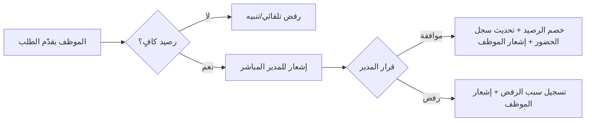
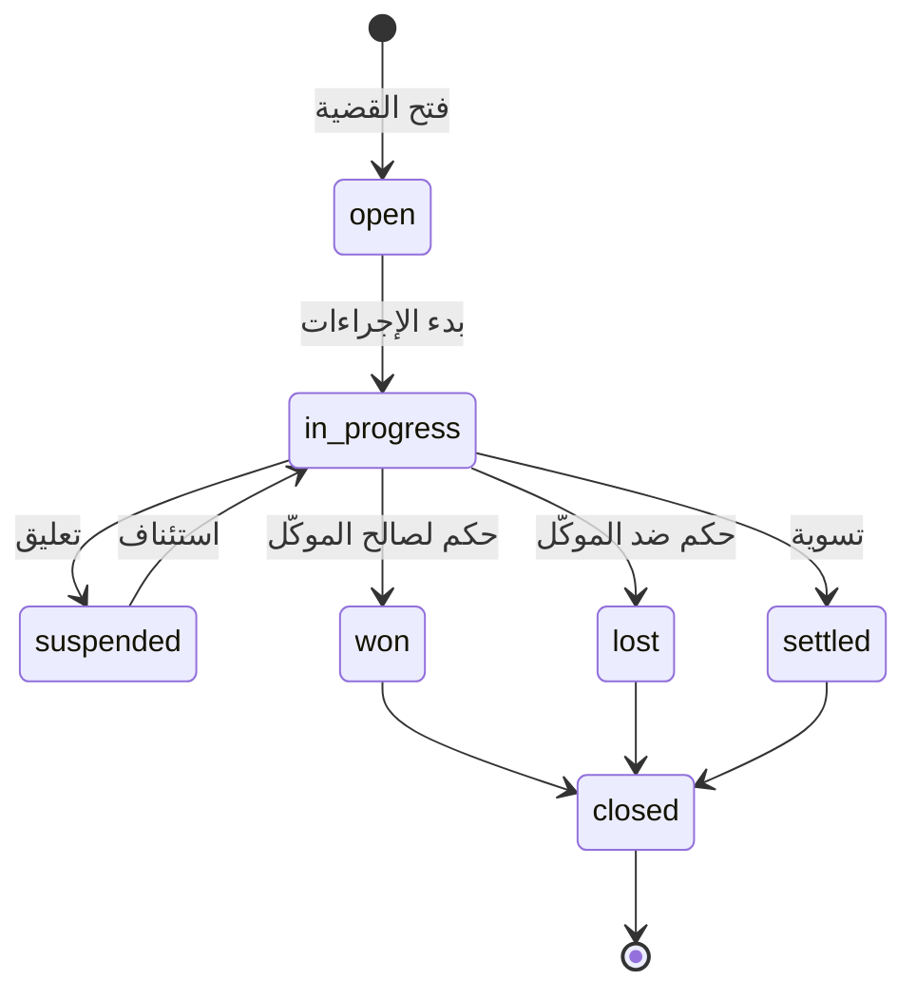

# 03 — الوحدات الوظيفية (Functional Modules)

يصف هذا الملف المنطق الوظيفي (Business Logic) وسير العمليات (Workflows) لكل وحدة. الحضور والبصمة في [ملف 04](04-attendance-biometrics.md)، والصلاحيات في [ملف 05](05-roles-permissions-security.md).

---

## أ) الموارد البشرية (HR)

### أ-1) إدارة الموظفين (Employee Management)

**العمليات (Operations):**
- إضافة/تعديل/أرشفة موظف (Soft Delete) مع جميع البيانات (شخصية، وظيفية، مالية، بنكية، مرفقات).
- سجل كامل لكل موظف (Timeline): تعيين، ترقيات، إجازات، تقييمات، إنذارات، مستندات.
- ربط الموظف بحساب مستخدم (User) وبمعرّف جهاز البصمة (`biometric_user_id`).
- تنبيهات آلية: انتهاء العقد، انتهاء وثيقة (هوية/رخصة)، عيد ميلاد، ذكرى تعيين.

**سير العمل — تعيين موظف جديد (Onboarding):**
```
إنشاء ملف موظف → رفع الوثائق → تعيين القسم والمدير والمسمى → تحديد الراتب والبدلات →
إنشاء حساب مستخدم وإسناد الأدوار → تسجيله في جهاز البصمة → تفعيل → إشعار للأطراف المعنية
```

**القواعد (Rules):** الرقم الوطني والرقم الوظيفي فريدان. لا يُحذف موظف له سجلات مالية/قضايا — يُنقل إلى `terminated`.

### أ-2) الإجازات (Leaves)

**العمليات:** طلب إجازة، اعتماد/رفض المدير، احتساب الأيام، خصم الرصيد، عرض التقويم السنوي.

**سير العمل — طلب إجازة:**


**القواعد:** الأنواع (سنوية/مرضية/طارئة/بدون راتب) لكل منها رصيد وقواعد. بعض الأنواع تتطلب مرفقاً (تقرير طبي). الإجازة المعتمدة تُظهر الموظف "في إجازة" في الحضور وتُستثنى من الغياب.

### أ-3) الرواتب (Payroll)

**العمليات:** إنشاء مسير شهري، احتساب (أساسي + بدلات + إضافي + مكافآت − خصومات − سلف − خصم غياب/تأخير)، اعتماد، صرف، إصدار كشف راتب PDF لكل موظف.

**معادلة الصافي:**
```
Net = Basic + Σ Allowances + Overtime + Bonus − Σ Deductions − Advances − AbsenceDeduction − Tax
```

**سير العمل — مسير الرواتب:**
```
اختيار الشهر/الفرع → سحب بيانات الحضور والإضافي والغياب من attendance_records →
سحب البدلات/الخصومات الثابتة والسلف → احتساب البنود آلياً → مراجعة (draft) →
اعتماد المدير المالي (approved) → توليد قيود محاسبية + كشوف PDF → وضع علامة "مدفوع" (paid) → إشعار الموظفين
```

**القواعد:** لا يُعتمد مسير إلا بعد إغلاق حضور الشهر. المسير المعتمد غير قابل للتعديل (يُلغى ويُعاد). الخصم عن التأخير/الغياب حسب سياسة الإعدادات.

### أ-4) تقييم الأداء (Performance)

**العمليات:** تقييم شهري/ربعي/سنوي عبر معايير (KPI) قابلة للتخصيص وأوزان، احتساب النتيجة والتقدير، ملاحظات، اعتماد الموظف (Acknowledge)، مقارنة تاريخية.

**القواعد:** النتيجة الكلية = Σ (score × weight). مؤشرات المحامين مرتبطة بأداء القضايا (نسبة الكسب، الجلسات المنجزة، الأتعاب المحصّلة).

---

## ب) الإدارة (Administration)

**العمليات:**
- **الأقسام والفروع:** إنشاء/تعديل الهيكل التنظيمي، تعيين المدراء.
- **المستخدمون والأدوار والصلاحيات:** (تفصيل في [ملف 05](05-roles-permissions-security.md)).
- **الإعدادات:** إعدادات عامة، بريد (SMTP)، رسائل (SMS Gateway)، إشعارات، ضرائب، سياسات الحضور/الإجازات، ترقيم المستندات.
- **القوالب:** قوالب البريد/الرسائل/العقود/الفواتير/كشوف الرواتب (متغيّرات ديناميكية {{name}}).
- **سجل العمليات (Audit):** عرض/تصفية/تصدير سجل التدقيق.
- **النسخ الاحتياطي:** جدولة/تشغيل نسخة يدوية، عرض السجل، الاستعادة (Admin فقط).

---

## ج) القضايا (Cases)

### ج-1) إدارة القضية

**العمليات:** إنشاء قضية (رقم داخلي + رقم محكمة)، ربطها بالعميل والمحكمة والمحامي المسؤول وفريق العمل، تسجيل الخصوم/الأطراف، إدارة الجلسات والمستندات والمذكرات والأحكام، التعليقات، وتايم لاين التعديلات (من Audit).

**دورة حياة القضية (State Machine):**


**القواعد:** رقم القضية الداخلي فريد ويُولَّد آلياً حسب نمط الإعدادات (مثل `CASE-2026-0001`). تقييد الوصول: المحامي يرى قضاياه فقط ما لم يكن له صلاحية `cases.view_all`.

### ج-2) الجلسات (Hearings)

**العمليات:** جدولة جلسة، تسجيل النتيجة، ترحيل (Postpone) بتوليد جلسة تالية، إشعار المحامي قبل 24 ساعة و1 ساعة، عرض في تقويم الجلسات ولوحة التحكم.

### ج-3) المستندات والمذكرات والأحكام

- **المستندات:** ترتبط بالأرشيف المركزي (`documents`) مع تصنيف قانوني.
- **المذكرات:** محرّر نصي غني + إمكانية توليد PDF من قالب.
- **الأحكام:** تسجيل الحكم، لصالح من، المبلغ، النهائية، ومهلة الاستئناف (مع تنبيه آلي قبل انتهائها).

---

## د) العملاء والعقود (Clients & Contracts)

**العمليات:**
- إدارة عملاء (أفراد/شركات) مع بياناتهم القانونية والضريبية وجهات الاتصال.
- ربط العميل بقضاياه وعقوده وفواتيره ومدفوعاته ومستنداته وسجل تواصله (عرض 360°).
- **العقود:** إنشاء اتفاقية أتعاب (ثابتة/بالساعة/شهرية/نسبة من الحكم)، ربطها بقضية، دورة فوترة، تنبيه انتهاء.
- **سجل التواصل:** توثيق كل مكالمة/اجتماع/بريد.

**القواعد:** لا يُحذف عميل له قضايا مفتوحة أو فواتير غير مسددة. تحويل عميل محتمل (Lead) إلى عميل يملأ الحقول آلياً.

---

## هـ) المالية (Finance)

**العمليات:**
- **الفواتير:** إصدار فاتورة (من عقد/قضية/يدوي) ببنود وضريبة وخصم، إرسالها للعميل، متابعة الحالة (مسودة/مرسلة/جزئي/مسدد/متأخر).
- **سندات القبض (Payments):** تسجيل دفعة مقابل فاتورة، تحديد الصندوق/البنك المستلِم، طرق الدفع، وربطها بالفاتورة لتحديث الرصيد.
- **سندات الصرف (Expenses):** صرف مصروف بتصنيف، ربطه بقضية عند اللزوم (رسوم محكمة)، مرفق الإيصال.
- **الصندوق والبنك:** أرصدة الحسابات، حركات الإيداع/السحب، التسوية البنكية.
- **القيود اليومية:** توليد آلي من الفواتير/المدفوعات/المصروفات/الرواتب (قيد مزدوج)، وقيود يدوية.
- **الضرائب:** احتساب ضريبة القيمة المضافة على الفواتير، تقرير الإقرار الضريبي.

**التكامل المحاسبي (Auto-Journal):**
```
فاتورة مبيعات  → مدين: ذمم العملاء | دائن: إيرادات أتعاب + ضريبة مستحقة
سند قبض       → مدين: الصندوق/البنك | دائن: ذمم العملاء
سند صرف       → مدين: مصروف (حسب التصنيف) | دائن: الصندوق/البنك
مسير رواتب    → مدين: مصروف رواتب | دائن: الصندوق/البنك + استحقاقات
```

**القواعد:** كل قيد متوازن (مدين=دائن). لا تعديل/حذف لقيد مرحّل أو سند — يُنشأ قيد عكسي. أرقام السندات متسلسلة لا تتكرر.

---

## و) التسويق (Marketing / CRM)

**العمليات:**
- **الحملات:** تعريف حملة بميزانية وقناة وفترة، وقياس العائد (عدد Leads/التحويلات مقابل الميزانية).
- **العملاء المحتملون (Leads):** التقاط، تسجيل المصدر، إسناد لموظف، تقييم (Score)، تحريك عبر المراحل (Pipeline).
- **المتابعة:** أنشطة (مكالمات/اجتماعات) بمواعيد وتذكيرات.
- **التحويل:** عند `won` يُنشأ عميل ويُربط بالـ Lead.

**Pipeline (لوحة كانبان):**
```
جديد → تم التواصل → مؤهّل → عرض/اقتراح → فوز (تحويل لعميل) | خسارة
```

**التقارير:** معدل التحويل، مصدر أفضل العملاء، عائد كل حملة، أداء كل موظف مبيعات.

---

## ز) المهام (Tasks)

**العمليات:** إنشاء مهمة، توزيعها على موظف/أكثر، تحديد أولوية وموعد، ربطها بقضية/عميل/Lead (Polymorphic)، تحديث نسبة الإنجاز والحالة، تعليقات، وإشعارات (تكليف جديد، اقتراب/تجاوز الموعد).

**العرض:** قائمة + لوحة كانبان (todo/in_progress/review/done) + تقويم الاستحقاق. "المهام المستحقة اليوم" تظهر في لوحة التحكم.

**القواعد:** تغيّر الحالة يُطلق إشعاراً. المهمة المرتبطة بجلسة تُغلق آلياً عند انعقادها (اختياري).

---

## ح) الأرشفة الإلكترونية (E-Archive)

**العمليات:** رفع مستند (يُخزَّن في S3 مع checksum ومجلد ووسوم)، ربطه بمالك (قضية/عميل/موظف/عقد)، إصدارات (Versioning)، بحث نصي كامل (Meilisearch) بالاسم/الوسم/المحتوى، معاينة (pdf.js)، تحميل، تقييد السري (`is_confidential`).

**القواعد:** لا حذف نهائي (Soft Delete + استعادة). المستندات السرية تخضع لصلاحية خاصة. التحقق من التكرار عبر الـ checksum.

---

## ملخص مصفوفة العمليات لكل وحدة (CRUD + Workflows)

| الوحدة | إنشاء | تعديل | حذف/أرشفة | اعتماد/سير عمل | تقارير | إشعارات |
|--------|:----:|:----:|:--------:|:-------------:|:------:|:-------:|
| الموظفون | ✅ | ✅ | أرشفة | Onboarding | ✅ | ✅ |
| الحضور | آلي/يدوي | تصحيح معتمد | ❌ | اعتماد التصحيح | ✅ | ✅ |
| الإجازات | ✅ | ✅ | إلغاء | موافقة/رفض | ✅ | ✅ |
| الرواتب | ✅ | draft فقط | إلغاء مسير | اعتماد/صرف | ✅ | ✅ |
| القضايا | ✅ | ✅ | أرشفة | State Machine | ✅ | ✅ |
| الجلسات | ✅ | ✅ | إلغاء | ترحيل | ✅ | ✅ |
| العملاء | ✅ | ✅ | أرشفة | — | ✅ | — |
| العقود | ✅ | ✅ | إنهاء | تفعيل | ✅ | ✅ |
| الفواتير | ✅ | draft فقط | إلغاء | إرسال/سداد | ✅ | ✅ |
| المدفوعات | ✅ | ❌ | عكس | — | ✅ | — |
| المصروفات | ✅ | ❌ | عكس | — | ✅ | — |
| القيود | آلي/يدوي | غير مرحّل | عكس | ترحيل | ✅ | — |
| Leads | ✅ | ✅ | أرشفة | Pipeline/تحويل | ✅ | ✅ |
| المهام | ✅ | ✅ | إلغاء | تغيّر الحالة | ✅ | ✅ |
| المستندات | ✅ | Metadata | أرشفة | Versioning | — | — |
