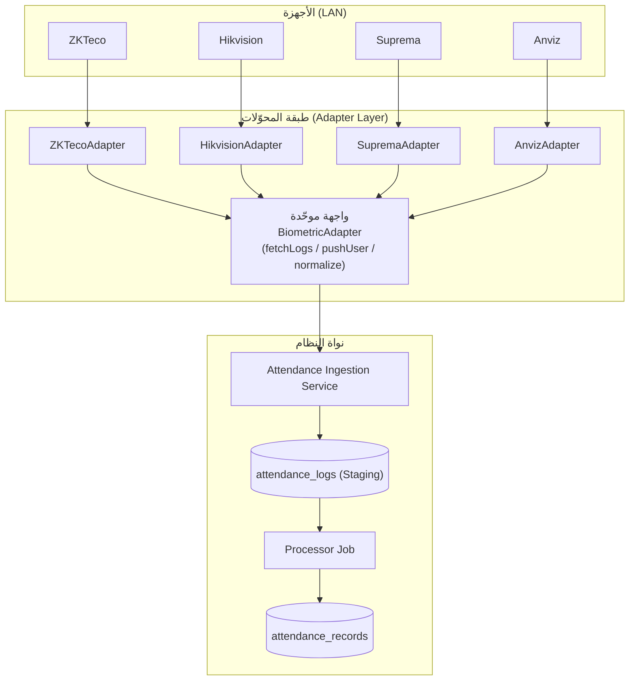
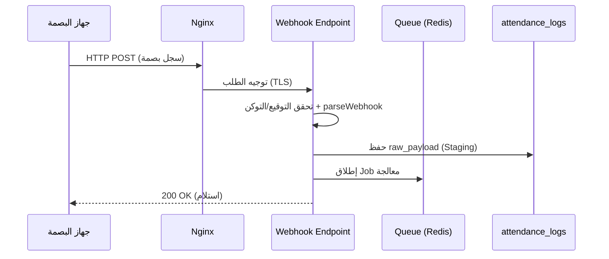
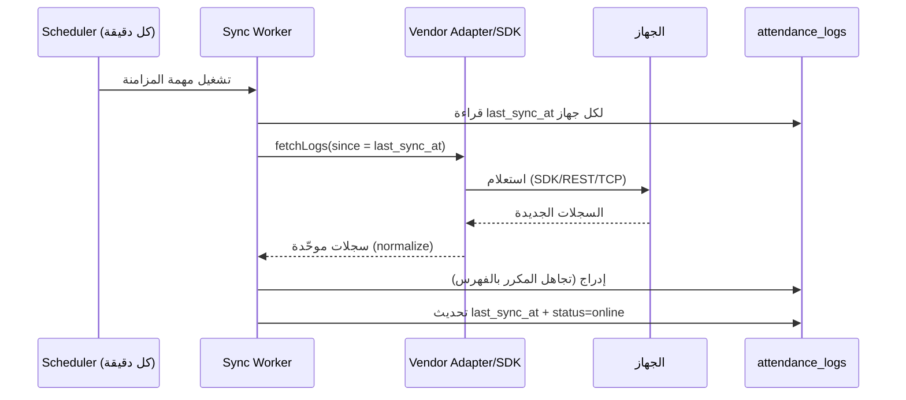
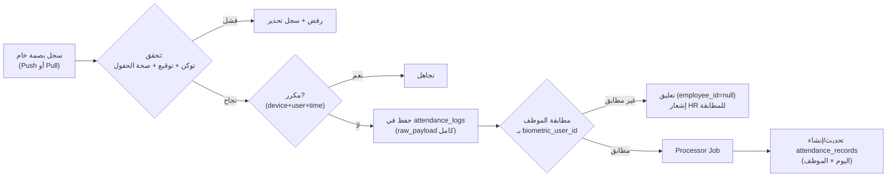

# 04 — الحضور والانصراف والربط مع أجهزة البصمة

يشرح هذا الملف بالتفصيل كيفية تسجيل الحضور يدوياً وآلياً، والربط مع أشهر أجهزة البصمة (ZKTeco, Hikvision, Suprema, Anviz)، وآلية استقبال السجلات والمزامنة المباشرة وحفظها في قاعدة البيانات.

---

## 1. أنماط تسجيل الحضور

| النمط | الوصف | الاستخدام |
|-------|-------|-----------|
| **يدوي (Manual)** | مسؤول HR يسجّل دخول/خروج الموظف يدوياً مع سبب | حالات عطل الجهاز / العمل الميداني / خارج المكتب |
| **بصمة إصبع (Fingerprint)** | الموظف يبصم على الجهاز داخل المكتب | التسجيل اليومي الأساسي |
| **بصمة الوجه (Face Recognition)** | التعرف على الوجه | بديل/إضافي بدون لمس |
| **بطاقة (Card/RFID)** | تمرير البطاقة | حسب الجهاز |

النظام يوحّد كل هذه المصادر في سجل `attendance_logs` ثم يعالجها إلى `attendance_records`.

---

## 2. طبقة تجريد المورّدين (Biometric Adapter Layer)

المشكلة: كل مورّد (ZKTeco/Hikvision/Suprema/Anviz) له بروتوكول/SDK مختلف.
الحل: **نمط المحوّل (Adapter Pattern)** — واجهة موحّدة `BiometricAdapter` يطبّقها محوّل لكل مورّد، فيبقى بقية النظام محايداً تجاه نوع الجهاز.

**الواجهة الموحّدة (منطقياً — دون كود):**
- `connect()` — فتح اتصال بالجهاز (IP/Port/Token).
- `fetchLogs(since)` — سحب السجلات الجديدة (Pull).
- `parseWebhook(payload)` — تفسير حمولة Push/Webhook.
- `normalize(raw)` — تحويل السجل الخام إلى نموذج موحّد: `{biometric_user_id, punch_time, punch_type, verify_mode}`.
- `enrollUser(employee)` / `deleteUser(id)` — إدارة المستخدمين على الجهاز.
- `getDeviceStatus()` — حالة الجهاز (online/offline).

---

## 3. طرق التكامل (Integration Modes)

هناك ثلاث طرق رئيسية، والنظام يدعمها جميعاً (يُحدَّد النمط في حقل `biometric_devices.api_mode`):

### الطريقة (A) — Push / Webhook (الأفضل للمزامنة المباشرة)
الجهاز نفسه يرسل كل بصمة فور حدوثها إلى Endpoint في النظام عبر HTTP(S).
- **ZKTeco (بروتوكول Push SDK / ADMS):** أجهزة ZKTeco المزوّدة بـ "Push" ترسل السجلات إلى خادم عبر HTTP POST (بروتوكول iClock/ADMS). نضبط في الجهاز عنوان الخادم (Server IP/Domain + Port) فيبدأ بإرسال البصمات.
- **Hikvision (ISAPI Event / HTTP Listening):** يدعم "HTTP Host Notification" — نضبط الجهاز ليُرسِل أحداث `AccessControllerEvent` (بصمة/وجه) إلى URL النظام، أو نشترك عبر ISAPI Alert Stream.
- **المزايا:** لحظي (Real-time)، لا حاجة لاستعلام دوري، يقلّل الحمل.

**تدفق Push:**

### الطريقة (B) — Pull / Polling (سحب دوري عبر SDK/API)
النظام يستعلم الجهاز كل فترة (مثلاً كل دقيقة عبر Scheduler) ويسحب السجلات الجديدة منذ آخر مزامنة.
- **ZKTeco:** عبر مكتبات مثل `pyzk` (بروتوكول UDP/TCP على المنفذ 4370) — دوال `get_attendance()`, `get_users()`. نستدعيها من خدمة/عامل (Worker) بايثون أو حزمة PHP مكافئة، ونمرّر الناتج لـ API النظام.
- **Hikvision:** ISAPI عبر HTTP: `GET /ISAPI/AccessControl/AcsEvent` مع فلترة زمنية لجلب أحداث الحضور.
- **Suprema:** عبر **BioStar 2 REST API** (المنصة الرسمية): مصادقة ثم `GET /api/events` لجلب أحداث الحضور، وإدارة المستخدمين عبر `/api/users`.
- **Anviz:** عبر **CrossChex API / SDK** أو بروتوكول TCP الخاص، لجلب السجلات وإدارة المستخدمين.
- **المزايا:** يعمل حتى لو لا يدعم الجهاز Push؛ تحكّم كامل في التوقيت وإعادة المحاولة.

**تدفق Pull:**

### الطريقة (C) — Cloud/Middleware
بعض المورّدين يوفّرون سحابة (ZKBio Cloud / BioStar Cloud / CrossChex Cloud) تعرض Webhooks/REST؛ يتكامل النظام معها بدل الاتصال المباشر بالجهاز — مفيد عند تعدد الفروع.

> **التوصية:** Push (A) كخيار أساسي للحظية، مع Pull (B) كشبكة أمان (Reconciliation) تسحب أي سجلات فاتت الـ Push كل بضع دقائق. هذا يضمن عدم فقدان أي بصمة.

---

## 4. مصفوفة دعم المورّدين

| المورّد | البروتوكول/الـ API | Push | Pull/SDK | ملاحظات التكامل |
|---------|--------------------|:----:|:--------:|------------------|
| **ZKTeco** | Push SDK/ADMS (iClock) + بروتوكول 4370 | ✅ | ✅ (`pyzk`/SDK) | الأوسع انتشاراً؛ إعداد "Server" على الجهاز للـ Push |
| **Hikvision** | ISAPI (HTTP/XML) + HTTP Host Notification | ✅ | ✅ | ضبط "Notify Surveillance Center"/HTTP Listening للأحداث |
| **Suprema** | BioStar 2 **REST API** + Webhooks | ✅ (Webhook) | ✅ (REST) | منصة BioStar 2 وسيطاً؛ مصادقة Session/JWT |
| **Anviz** | CrossChex API/SDK + TCP | ⚠️ (عبر السحابة) | ✅ | CrossChex Standard/Cloud أو SDK محلي |

---

## 5. آلية استقبال السجلات وحفظها (Ingestion Pipeline)

**خطوات المعالجة (Processor):**
1. **التحقق (Validation):** توكن مشترك/HMAC لكل جهاز، صحة التاريخ والحقول.
2. **منع التكرار (Idempotency):** فهرس فريد منطقي `(device_id, biometric_user_id, punch_time)` — أي إعادة إرسال تُتجاهل.
3. **الحفظ الخام (Staging):** كل نبضة تُحفظ كاملةً في `attendance_logs` مع `raw_payload` (JSONB) — لا فقدان.
4. **المطابقة (Matching):** ربط `biometric_user_id` بـ `employees.biometric_user_id`. غير المطابَق يبقى معلّقاً مع إشعار HR.
5. **الاحتساب (Aggregation):** تجميع نبضات اليوم مقابل نوبة العمل (`work_shifts`):
   - أول `in` = `check_in`، آخر `out` = `check_out`.
   - `late_minutes` = تأخر الدخول عن (بداية النوبة + سماح `grace_minutes`).
   - `early_leave_minutes` = المغادرة قبل نهاية النوبة.
   - `overtime_minutes` = العمل بعد نهاية النوبة (حسب السياسة).
   - `worked_minutes` = صافي وقت العمل.
   - تحديد `status`: present/late/absent (لا سجل) /leave (إجازة معتمدة) /holiday/weekend.
6. **التصنيف والإنذارات:** تجاوز حدود التأخير المتكرر يولّد إنذاراً وإشعاراً (حسب سياسة الإعدادات).

---

## 6. مزامنة المستخدمين إلى الأجهزة (Enrollment Sync)

عند إضافة/حذف موظف، يجب أن ينعكس على الأجهزة:
- **إضافة موظف** → `enrollUser()` يدفع `biometric_user_id` والاسم للجهاز/الأجهزة في فرعه.
- **إيقاف/إنهاء** → `deleteUser()` يزيله من الأجهزة لمنع تسجيله.
- التسجيل البيومتري الفعلي (الإصبع/الوجه) يتم على الجهاز نفسه لمرة واحدة، والنظام يربط المعرّف فقط.

---

## 7. معالجة الحالات الحدّية (Edge Cases) والموثوقية

| الحالة | المعالجة |
|--------|----------|
| انقطاع الشبكة أثناء Push | الجهاز يخزّن محلياً ويعيد الإرسال؛ + مهمة Pull للتسوية تلتقط الفائت |
| الجهاز Offline | `status=offline` + إشعار للإدارة + السماح بالتسجيل اليدوي |
| بصمة مكررة (دخول مزدوج) | منطق التجميع يأخذ الأول/الأخير ويتجاهل النبضات المتقاربة |
| بصمة لموظف غير مسجّل | تُحفظ معلّقة + إشعار HR للمطابقة اليدوية |
| اختلاف توقيت الجهاز | تخزين UTC + مزامنة ساعة الجهاز (NTP) دورياً |
| تعديل يدوي على سجل | يتطلب اعتماد (`approved_by`) ويُسجَّل في Audit |
| نسيان الخروج | تنبيه للموظف/HR + قاعدة إغلاق افتراضية عند نهاية النوبة (تُعلَّم للمراجعة) |

**الموثوقية:** طوابير (Redis Queue) مع إعادة محاولة أُسّية، Idempotency، Staging لا يُفقد، ومهمة تسوية دورية (Reconciliation) تضمن اتساق `attendance_logs` مع الأجهزة.

---

## 8. الأمان في تكامل البصمة

- كل جهاز له **توكن/مفتاح سري** يُرسَل مع كل Push (تحقق HMAC/Bearer).
- استقبال Push عبر **HTTPS فقط**، ويفضّل تقييد المصدر بـ IP Allowlist (شبكة المكتب) أو VPN.
- تخزين `auth_token` مشفّراً في قاعدة البيانات.
- عزل شبكي: أجهزة البصمة على VLAN منفصل، والوصول للنظام عبر بوابة محددة.
- كل عملية إدارة أجهزة/مطابقة تُسجَّل في Audit.

---

## 9. مخرجات وحدة الحضور (تغذّي التقارير والرواتب)

- سجل حضور يومي دقيق لكل موظف.
- احتساب التأخير/الغياب/الإضافي آلياً → يدخل مباشرة في **مسير الرواتب**.
- مؤشرات لوحة التحكم: **الموجودون الآن / المتأخرون / الغائبون** (لحظياً عبر WebSocket).
- تقارير: الحضور، الغياب، التأخير، الإضافي (يومي/شهري/لكل موظف/قسم/فرع).
- إنذارات الانضباط الوظيفي.
