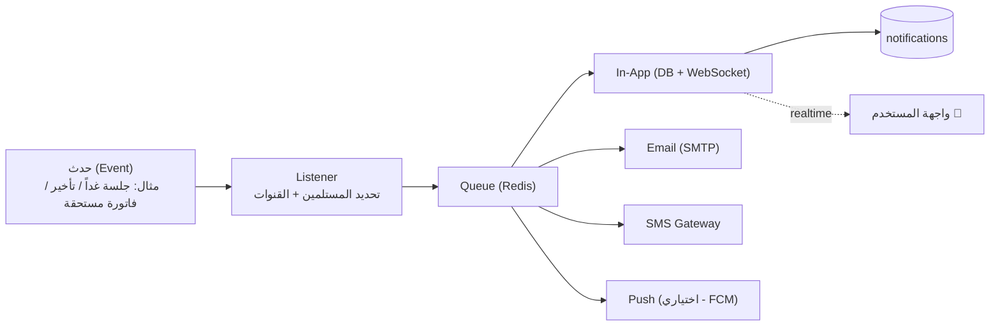

# 08 — الإشعارات والأتمتة (Notifications & Automation)

---

## 1. محرك الإشعارات (Notification Engine)

نظام إشعارات موحّد متعدد القنوات، مبني على **Events + Queue + Channels**: أي حدث في النظام يُطلق Event، فيلتقطه Listener يحدّد المستلمين والقنوات المناسبة (حسب `notification_settings`)، ويضع مهام إرسال في الطابور.

## 2. القنوات (Channels)

| القناة | الاستخدام | التقنية |
|--------|-----------|---------|
| **In-App** | كل الإشعارات (سجل + جرس) | جدول `notifications` + WebSocket |
| **Email** | الرسمية/التفصيلية (كشوف، تقارير، اعتمادات) | SMTP + قوالب |
| **SMS** | العاجلة (جلسة اليوم، فاتورة مستحقة) | بوابة SMS محلية |
| **Push** | تطبيق الجوال (Phase 2) | FCM |
| **WhatsApp** | اختياري (تذكير العملاء) | WhatsApp Business API |

المستخدم يتحكّم بقنوات كل نوع عبر `notification_settings` (تفعيل/تعطيل).

## 3. أنواع الإشعارات ومحفّزاتها (Triggers)

| الحدث (Trigger) | المستلمون | القنوات | التوقيت |
|------------------|-----------|---------|---------|
| تأخّر موظف | HR + المدير المباشر | In-App/Email | فور احتساب التأخير |
| غياب موظف | HR + المدير المباشر | In-App/Email | نهاية فترة السماح |
| جلسة اليوم / غداً | المحامي المسؤول + السكرتارية | In-App/SMS/Email | قبل 24 ساعة و1 ساعة |
| اقتراب انتهاء عقد موظف | HR + الإدارة | In-App/Email | قبل 30/15/7 أيام |
| اقتراب انتهاء عقد عميل/وثيقة | مدير الحساب | In-App/Email | قبل 30/7 أيام |
| انتهاء إجازة (عودة موظف) | HR + المدير | In-App | يوم العودة |
| طلب إجازة جديد | المدير المعتمِد | In-App/Email | فور الطلب |
| قرار على طلب إجازة | الموظف مقدّم الطلب | In-App/Email | فور القرار |
| مهمة جديدة مُسندة | المكلّف | In-App/Push | فور الإسناد |
| اقتراب/تجاوز موعد مهمة | المكلّف | In-App | قبل الموعد + عند التجاوز |
| فاتورة مستحقة/متأخرة | المالية (+ العميل اختياري) | In-App/Email/SMS | يوم الاستحقاق + بعده |
| قضية جديدة أُسندت | المحامي المسؤول | In-App/Email | فور الإنشاء |
| مسير رواتب معتمد/مصروف | الموظفون + المالية | In-App/Email | عند الاعتماد/الصرف |
| مهلة استئناف تقترب | المحامي | In-App/Email | قبل انتهاء المهلة |
| جهاز بصمة Offline | Admin/HR | In-App/Email | عند فقد الاتصال |
| محاولة دخول مشبوهة | مالك الحساب + Admin | In-App/Email | فوري |

## 4. المهام المجدولة (Scheduled Jobs / Cron)

يعمل Scheduler (Cron) على تشغيل مهام دورية عبر الطابور:

| المهمة | التكرار | الوظيفة |
|--------|---------|---------|
| مزامنة/تسوية البصمة (Pull) | كل دقيقة | التقاط أي سجلات فاتت الـ Push |
| احتساب الغياب | يومي (بعد نهاية الدوام) | تعليم من لم يحضر غائباً |
| تذكير الجلسات | كل ساعة | إرسال تذكيرات 24س/1س |
| تنبيهات انتهاء العقود/الوثائق | يومي | فحص التواريخ القريبة |
| تنبيهات الفواتير المتأخرة | يومي | فحص الاستحقاقات |
| تحديث مؤشرات لوحة التحكم | كل 5-15 دقيقة | تحديث Materialized Views/Cache |
| التقارير الدورية | يومي/أسبوعي/شهري | توليد وإرسال التقارير المجدولة |
| النسخ الاحتياطي | يومي (ليلاً) | نسخة كاملة + رفع للتخزين البعيد |
| تنظيف الجلسات المنتهية | يومي | حذف الجلسات المنتهية |
| أرشفة الأقسام القديمة | شهري | نقل بيانات السجلات القديمة |

## 5. القوالب (Templates)

- قوالب قابلة للتخصيص لكل نوع (بريد/رسالة) مع متغيّرات ديناميكية: `{{employee_name}}`, `{{hearing_date}}`, `{{invoice_no}}`, `{{amount}}`.
- دعم لغتين (عربي/إنجليزي) لكل قالب.
- تُدار من شاشة الإعدادات › القوالب.

## 6. الموثوقية

- **الطابور (Queue):** كل إرسال يمر عبر Redis Queue مع إعادة محاولة أُسّية عند الفشل.
- **حالة الإشعار:** `pending → sent → failed/read` لتتبع التسليم.
- **منع التكرار:** أعلام مثل `hearings.reminder_sent` تمنع إرسال نفس التذكير مرتين.
- **تجميع (Digest):** خيار تجميع الإشعارات غير العاجلة في ملخص يومي لتقليل الإزعاج.
- **المراقبة:** فشل الإرسال المتكرر يُسجَّل ويُنبَّه عنه Admin.

## 7. البث اللحظي (Real-time)

- **WebSocket (Reverb/Socket.io):** دفع الإشعارات الفورية للجرس 🔔 وتحديث لوحة التحكم (الحضور اللحظي) دون تحديث الصفحة.
- قنوات خاصة لكل مستخدم (Private Channel) مؤمّنة بالتوكن، وقنوات للفرع/القسم للإحصاءات المشتركة.
