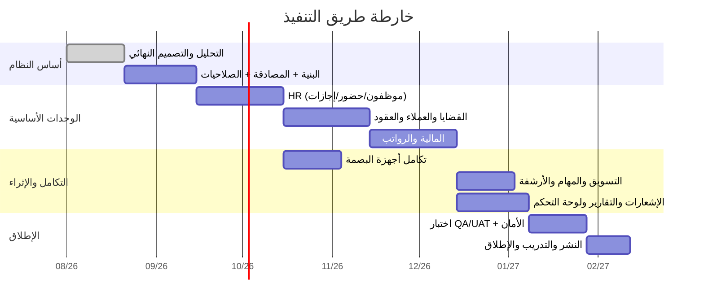

# 09 — واجهة برمجة التطبيقات وخارطة الطريق (API & Roadmap)

---

## الجزء الأول: تصميم الـ API

### 1. المبادئ
- **RESTful** موثّق بـ **OpenAPI (Swagger)**، إصدارات عبر البادئة `/api/v1`.
- **JSON** للطلب والاستجابة، تواريخ **ISO-8601 (UTC)**.
- **المصادقة:** `Authorization: Bearer <JWT>`؛ تجديد عبر `/auth/refresh`.
- **استجابة موحّدة:** `{ data, meta, errors }` مع رموز HTTP صحيحة.
- **الترقيم/الفرز/الفلترة:** `?page=&per_page=&sort=&filter[field]=`.
- **Idempotency-Key** للعمليات المالية الحسّاسة (منع الازدواج).
- **Rate Limiting** لكل مستخدم/عميل.

### 2. أمثلة على نقاط النهاية (Endpoints)

| المجال | الطريقة والمسار | الوصف |
|--------|------------------|-------|
| Auth | `POST /auth/login` · `POST /auth/refresh` · `POST /auth/logout` · `POST /auth/mfa/verify` | المصادقة و MFA |
| Employees | `GET/POST /employees` · `GET/PUT/DELETE /employees/{id}` | إدارة الموظفين |
| Attendance | `GET /attendance` · `POST /attendance/manual` · `POST /attendance/{id}/approve` | الحضور |
| Biometric Webhook | `POST /webhooks/biometric/{deviceId}` | استقبال Push من الأجهزة |
| Leaves | `GET/POST /leaves` · `POST /leaves/{id}/approve` · `POST /leaves/{id}/reject` | الإجازات |
| Payroll | `GET/POST /payrolls` · `POST /payrolls/{id}/approve` · `GET /payrolls/{id}/payslips/{empId}` | الرواتب |
| Cases | `GET/POST /cases` · `GET/PUT /cases/{id}` · `POST /cases/{id}/close` | القضايا |
| Hearings | `GET/POST /cases/{id}/hearings` · `POST /hearings/{id}/postpone` | الجلسات |
| Clients | `GET/POST /clients` · `GET /clients/{id}/overview` | العملاء |
| Contracts | `GET/POST /contracts` | العقود |
| Invoices | `GET/POST /invoices` · `POST /invoices/{id}/payments` · `GET /invoices/{id}/pdf` | الفواتير والدفع |
| Expenses | `GET/POST /expenses` | المصروفات |
| Journal | `GET/POST /journal-entries` · `POST /journal-entries/{id}/post` | القيود |
| Leads | `GET/POST /leads` · `POST /leads/{id}/convert` | التسويق |
| Tasks | `GET/POST /tasks` · `PATCH /tasks/{id}` | المهام |
| Documents | `POST /documents` · `GET /documents/{id}/download` | الأرشيف |
| Notifications | `GET /notifications` · `POST /notifications/{id}/read` | الإشعارات |
| Reports | `POST /reports/{type}` · `GET /reports/{jobId}/download` | التقارير |
| Dashboard | `GET /dashboard/kpis` · `GET /dashboard/charts` | لوحة التحكم |
| Admin | `GET/POST /users` · `GET/POST /roles` · `GET /audit-logs` · `GET/PUT /settings` | الإدارة |

### 3. WebSocket (Realtime)
- قناة خاصة لكل مستخدم: `private-user.{id}` — الإشعارات.
- قناة الفرع: `presence-branch.{id}` — الحضور اللحظي، من متصل.
- أحداث: `notification.created`, `attendance.updated`, `hearing.reminder`, `task.assigned`.

### 4. تكامل خارجي
- **Webhooks واردة:** من أجهزة البصمة (موقّعة بـ HMAC).
- **مزودون:** SMS Gateway، SMTP، (مستقبلاً) بوابات دفع وأنظمة محاكم.
- **تصدير:** REST يتيح للبوابات المستقبلية (تطبيق جوال/بوابة عملاء) استهلاك نفس الـ API.

---

## الجزء الثاني: خارطة الطريق (Roadmap) والتقديرات

### المراحل (Phases)

### تفصيل المراحل

| المرحلة | المخرجات | المدة التقديرية |
|---------|----------|------------------|
| **P0 — التأسيس** | تثبيت المعمارية، DB Schema، المصادقة، RBAC، الهيكل الأساسي، CI/CD، البيئات | 3-4 أسابيع |
| **P1 — HR الأساسي** | الموظفون، الأقسام/الفروع، الحضور اليدوي، الإجازات | 4 أسابيع |
| **P2 — تكامل البصمة** | محوّلات المورّدين، الاستقبال، المزامنة، الاحتساب | 3 أسابيع (بالتوازي) |
| **P3 — القضايا والعملاء** | القضايا، الجلسات، العملاء، العقود، الأرشيف | 4-5 أسابيع |
| **P4 — المالية والرواتب** | الفواتير، السندات، القيود، الرواتب، الضرائب | 4-5 أسابيع |
| **P5 — التسويق والمهام** | CRM/Leads، الحملات، المهام | 3 أسابيع |
| **P6 — الإشعارات والتقارير** | محرك الإشعارات، لوحة التحكم، كل التقارير | 3-4 أسابيع |
| **P7 — التدقيق والأمان** | Audit، تحصين OWASP، MFA، اختبار اختراق | 2-3 أسابيع |
| **P8 — QA/UAT والإطلاق** | اختبار، هجرة بيانات، تدريب، نشر إنتاجي | 3-4 أسابيع |

> **الإجمالي التقديري:** ~6-7 أشهر لفريق متكامل (2 Backend، 2 Frontend، 1 DevOps/DBA، 1 QA، 1 PM/BA)، مع تسليمات تدريجية (MVP بعد P1+P4).

### فريق التنفيذ المقترح
| الدور | العدد | المسؤولية |
|-------|:----:|-----------|
| Product/Business Analyst | 1 | المتطلبات، UAT، التوثيق |
| Backend Developer | 2 | API، منطق الأعمال، التكامل |
| Frontend Developer | 2 | الواجهات، لوحة التحكم |
| DevOps / DBA | 1 | البنية، النشر، النسخ الاحتياطي، الأداء |
| QA Engineer | 1 | الاختبار الآلي/اليدوي، الجودة |
| UI/UX Designer | 1 (جزئي) | التصاميم، تجربة المستخدم |

---

## الجزء الثالث: اقتراحات التحسين (Enhancements)

### تحسينات قريبة المدى
1. **بوابة عميل (Client Portal):** يتابع العميل قضاياه وفواتيره ومستنداته ذاتياً.
2. **تطبيق جوال للموظفين:** حضور بالموقع الجغرافي (Geo-fence)، طلب إجازة، مهام، إشعارات Push.
3. **التوقيع الإلكتروني (e-Signature)** للعقود والمذكرات.
4. **قوالب مستندات ذكية:** توليد مذكرات/عقود من قوالب بمتغيّرات.
5. **لوحة تحكم قابلة للتخصيص (Drag & Drop Widgets).**

### تحسينات متوسطة المدى
6. **تكامل مع أنظمة المحاكم الحكومية** (حسب توفر API) لجلب مواعيد الجلسات آلياً.
7. **تكامل بوابات الدفع الإلكتروني** لتحصيل الأتعاب أونلاين.
8. **محاسبة تكاليف القضية (Case Costing)** وربحية كل قضية بدقة.
9. **تتبّع الوقت (Time Tracking)** للأتعاب بالساعة لكل محامٍ.
10. **إدارة معرفة (Knowledge Base)** للسوابق والنماذج القانونية.

### تحسينات بالذكاء الاصطناعي (Phase 3)
11. **تلخيص المستندات القانونية** واستخراج البنود تلقائياً.
12. **مساعد صياغة المذكرات** المدعوم بالـ LLM.
13. **البحث الدلالي (Semantic Search)** في أرشيف القضايا.
14. **التنبؤ بنتائج القضايا** بناءً على السوابق (تحليلي).
15. **روبوت محادثة داخلي** للاستعلام عن القضايا/العملاء بلغة طبيعية.

### تحسينات تقنية
16. **Read Replicas + Materialized Views** لتسريع التقارير الثقيلة.
17. **Full-Text Search عربي متقدم** (Meilisearch/OpenSearch) عبر كل الكيانات.
18. **CQRS/Event Sourcing** للوحدات عالية التدقيق (المالية) عند التوسع.
19. **تعدد المكاتب (Multi-Tenant SaaS)** لتحويل النظام لمنتج يُباع لمكاتب أخرى.
20. **مراقبة وأداء (APM)** عبر Prometheus/Grafana/Sentry مع تنبيهات استباقية.

---

## الخلاصة

هذا المستند يقدّم تصميماً متكاملاً وقابلاً للتنفيذ المباشر لنظام ERP/HR لمكتب محاماة:
- **معمارية** حديثة قابلة للتوسع (Modular Monolith → Microservices).
- **قاعدة بيانات** مُطبّعة (~65 جدولاً) بعلاقات وفهارس ومفاتيح واضحة.
- **صلاحيات وأمان** على مستوى المؤسسات (RBAC/ABAC، MFA، OWASP، Audit).
- **تكامل بصمة** حقيقي مع ZKTeco/Hikvision/Suprema/Anviz عبر طبقة محوّلات.
- **وحدات وظيفية** كاملة تغطي كل ما طُلب، مع شاشات وتقارير وإشعارات مفصّلة.
- **خارطة طريق** واقعية بتقديرات وفريق ومراحل تسليم تدريجية.

النظام مصمّم ليبدأ بـ 10 موظفين ويتوسّع إلى أي حجم دون إعادة بناء.
