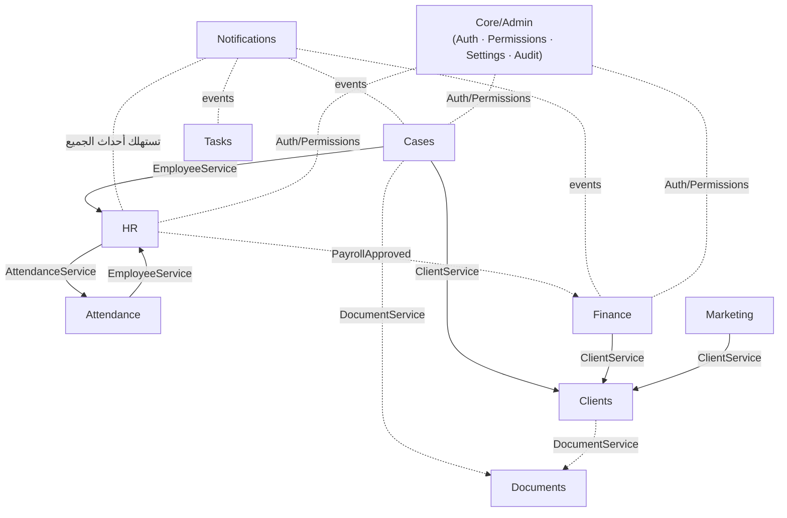

# حدود الوحدات (Module Boundaries)

يعرّف هذا المستند حدود كل وحدة في الـ **Modular Monolith**: ما تملكه، وواجهتها العامة، والأحداث التي تصدرها، وتبعياتها، وما لا يُسمح لها بالوصول إليه مباشرة. الهدف: **عمل متوازٍ بلا تشابك**، ومسار نظيف لفصل أي وحدة كخدمة مستقلة مستقبلاً (انظر [ADR-001](adr/001-modular-monolith.md)).

## القاعدة الذهبية
> **لا تصل وحدة إلى جداول وحدة أخرى مباشرةً.** التواصل بين الوحدات يكون عبر **الخدمات العامة (Public Services/APIs)** أو **الأحداث (Domain Events)** فقط. أي استعلام يعبر حدود وحدة يمرّ عبر واجهتها المعلنة.

---

## 1. وحدة الموارد البشرية (HR)
- **Owns (تملك):** `employees`, `departments`, `employee_allowances`, `employee_deductions`, `employee_documents`, `leave_types`, `leave_balances`, `leave_requests`, `payrolls`, `payroll_items`, `salary_advances`, `performance_reviews`, `performance_criteria`, `review_scores`.
- **Exposes (تُتيح):** `EmployeeService` (بيانات الموظف الأساسية للوحدات الأخرى)، `PayrollService`.
- **Emits (تُصدر أحداثاً):** `EmployeeCreated`, `EmployeeTerminated`, `LeaveApproved`, `PayrollApproved`.
- **Depends on (تعتمد على):** Attendance (قراءة ملخص الحضور للرواتب — عبر `AttendanceService`)، Finance (لتوليد قيد الرواتب — عبر حدث `PayrollApproved`).
- **Cannot access directly (ممنوع):** جداول Finance/Cases مباشرةً.

## 2. وحدة الحضور (Attendance)
- **Owns:** `biometric_devices`, `attendance_logs`, `attendance_records`, `work_shifts`, `employee_shifts`.
- **Exposes:** `AttendanceService` (ملخص الحضور الشهري لموظف — يستهلكه Payroll)، `BiometricAdapter` (طبقة المحوّلات).
- **Emits:** `AttendanceRecorded`, `LateDetected`, `AbsenceDetected`, `DeviceOffline`.
- **Depends on:** HR (مطابقة `biometric_user_id` بالموظف — عبر `EmployeeService`).
- **Cannot access directly:** جداول الرواتب؛ يقدّم البيانات فقط ولا يحتسب الراتب.

## 3. وحدة القضايا (Cases)
- **Owns:** `cases`, `case_types`, `courts`, `case_lawyers`, `case_parties`, `hearings`, `case_documents`, `case_memos`, `judgments`, `case_comments`.
- **Exposes:** `CaseService`, `HearingService`.
- **Emits:** `CaseCreated`, `CaseClosed`, `HearingScheduled`, `JudgmentRecorded`.
- **Depends on:** Clients (ربط القضية بالعميل — عبر `ClientService`)، HR (المحامي المسؤول — عبر `EmployeeService`)، Documents (تخزين المرفقات — عبر `DocumentService`).
- **Cannot access directly:** جداول Finance؛ الفوترة تُطلب عبر حدث/خدمة.

## 4. وحدة العملاء والعقود (Clients)
- **Owns:** `clients`, `client_contacts`, `contracts`, `communications`.
- **Exposes:** `ClientService`, `ContractService`.
- **Emits:** `ClientCreated`, `ContractActivated`, `ContractExpiring`.
- **Depends on:** Documents (نُسخ العقود)، HR (مدير الحساب).
- **Cannot access directly:** جداول Cases (يقرأ عبر `CaseService` عند الحاجة).

## 5. وحدة المالية (Finance)
- **Owns:** `chart_of_accounts`, `invoices`, `invoice_items`, `payments`, `expenses`, `expense_categories`, `financial_accounts`, `journal_entries`, `journal_lines`, `taxes`.
- **Exposes:** `InvoiceService`, `PaymentService`, `JournalService`.
- **Emits:** `InvoiceIssued`, `InvoicePaid`, `PaymentReceived`, `JournalPosted`.
- **Depends on:** Clients (بيانات العميل للفوترة)، Cases (ربط الفاتورة/المصروف بقضية)، HR (قيد الرواتب عبر حدث `PayrollApproved`).
- **Cannot access directly:** لا تعدّل جداول أي وحدة أخرى؛ تستقبل الأحداث وتولّد القيود.
- **قاعدة خاصة:** القيود المرحّلة والسندات **غير قابلة للتعديل/الحذف** — تُعكَس فقط (Reversal).

## 6. وحدة التسويق (Marketing/CRM)
- **Owns:** `campaigns`, `leads`, `lead_activities`.
- **Exposes:** `LeadService`.
- **Emits:** `LeadCreated`, `LeadConverted`.
- **Depends on:** Clients (عند التحويل يُنشئ عميلاً عبر `ClientService`).
- **Cannot access directly:** جداول Clients (الإنشاء عبر الخدمة لا الجدول).

## 7. وحدة المهام (Tasks)
- **Owns:** `tasks`, `task_assignees`, `task_comments`.
- **Exposes:** `TaskService`.
- **Emits:** `TaskAssigned`, `TaskCompleted`, `TaskOverdue`.
- **Depends on:** HR (المكلّفون)، وارتباط Polymorphic بأي كيان (Case/Client/Lead) عبر خدماتها.

## 8. وحدة الإشعارات (Notifications)
- **Owns:** `notifications`, `notification_settings`.
- **Exposes:** `NotificationService` (`notify(user, type, data, channels)`).
- **Consumes (تستهلك أحداث الجميع):** `HearingScheduled`, `LateDetected`, `InvoiceIssued`, `ContractExpiring`, `TaskAssigned`, `LeaveApproved` ... إلخ.
- **Depends on:** لا تعتمد على منطق أي وحدة؛ تستقبل الأحداث فقط وتوجّهها للقنوات (In-App/Email/SMS/Push).
- **قاعدة خاصة:** الإشعارات وحدة **مستهلِكة للأحداث** (Event Consumer) — نقطة الفصل الأولى المرشّحة لخدمة مستقلة مستقبلاً.

## 9. وحدة الأرشفة (Documents)
- **Owns:** `documents`, `document_folders`, `document_tags`, `document_tag_map`, `document_versions`.
- **Exposes:** `DocumentService` (`store`, `attachTo(ownerType, ownerId)`, `signedUrl`).
- **Emits:** `DocumentUploaded`.
- **Depends on:** التخزين (S3/MinIO)، والبحث (Meilisearch).
- **قاعدة خاصة:** كل مرفقات النظام تمرّ عبر هذه الوحدة (مالك Polymorphic) — لا ترفع أي وحدة ملفاتها بنفسها.

## 10. وحدة النواة/الإدارة (Core/Admin)
- **Owns:** `users`, `roles`, `permissions`, `role_permission`, `user_role`, `sessions`, `branches`, `settings`, `audit_logs`, `activity_logs`.
- **Exposes:** `AuthService`, `PermissionService` (فحص الصلاحيات لكل الوحدات)، `SettingsService`, `AuditService`.
- **Emits:** `UserLoggedIn`, `PermissionChanged`.
- **ملاحظة:** وحدة عرضية (Cross-cutting) يعتمد عليها الجميع للمصادقة والصلاحيات والتدقيق والإعدادات.

---

## مخطط التبعيات بين الوحدات

## قواعد فرض الحدود (Enforcement)
1. **مراجعة الكود (Code Review):** رفض أي استعلام يقرأ/يكتب جدول وحدة أخرى مباشرةً.
2. **بنية المجلدات:** كل وحدة في مجلد/Namespace مستقل، وجداولها ببادئة واضحة.
3. **الأحداث أولاً:** التفاعلات غير المتزامنة (إشعار، قيد، مهمة) عبر Domain Events لا استدعاء مباشر.
4. **اختبار الحدود:** اختبارات معمارية (ArchTest) تمنع الاستيراد عبر الحدود الممنوعة.
